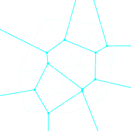

## Voronoi Diagram

在凸多边形内的点的距离都小于到其他点的距离

## Delaunay Triangulation

connect each node to every other node that shares an edge

通过三角形划分空间

Delaunay triangulations maximize the minimum angle of all the angles of the triangles in the triangulation

## ref

- blog
    - [Robot Path Planning Using Generalized Voronoi Diagrams](https://www.cs.columbia.edu/~pblaer/projects/path_planner/)