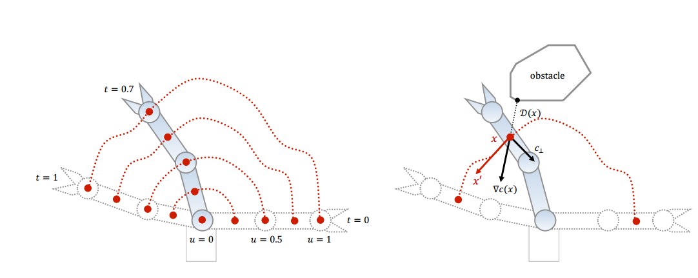

CHMOP: Covariant Hamiltonian Optimization
for Motion Planning

## introduction

轨迹优化在最优控制问题上已能得出最优的结果，而受限于计算资源和局部极值，这一方法很少在运动规划上有类似的成果。而本方法致力于在综合考虑动力学，平滑性和避障的基础上产生最优的运动规划结果。

基于以下两个原则：

1. Gradient information is often available and can be computed inexpensively.
2. Trajectory optimization should be invariant to parametrization

突破限制：

1. 使用蒙特卡罗(Hamiltonian Monte Carlo, HMC) 进行采样，同时产生扰动避免局部极值
2. 运动学约束可以被加入到约束流形中，加速迭代

自身局限：

- 不适于高维运动规划

## objective functional

$$\mathcal{U}[\xi]=\mathcal{F}_{\text {obs }}[\xi]+\lambda \mathcal{F}_{\text {smooth }}[\xi]$$

- $\xi$： 运动轨迹，机器人构形相对时间的函数。$\xi(0)=q_0, \xi(1)=q_1$
- $\mathcal{F}_{\text {obs }}[\xi]$: 环境障碍物惩罚函数
- $\mathcal{F}_{\text {smooth }}[\xi]$: 动力学平滑惩罚函数

$$\mathcal{F}_{o b s}[\xi]=\int_{0}^{1} \int_{\mathcal{B}} c(x(\xi(t), u))\left\|\frac{d}{d t} x(\xi(t), u)\right\| d u d t$$



- $x(\xi(t), u)$: 由轨迹点和机器人局部任一位置(body point)定义的全局位置点(workspace position)
- $x'$: 全局位置点的速度
- $\nabla c(x)$: collision cost 的梯度

障碍物惩罚函数定义为对机器人上每一个点的colliison cost在空间和时间上的积分。

$$\mathcal{F}_{o b s}[\xi]=\int_{0}^{1} \max _{u \in \mathcal{B}} c(x(\xi(t), u))\left\|\frac{d}{d t} x(\xi(t), u)\right\| d t$$

为简化计算，在每一时刻只计算最大cost的点。

$$\mathcal{F}_{\text {smooth }}[\xi]=\frac{1}{2} \int_{0}^{1}\left\|\frac{d}{d t} \xi(t)\right\|^{2} d t$$

平滑性以加速度衡量。

## implementation in moveit

[chmop in moveit](https://github.com/ros-planning/moveit2/tree/main/moveit_planners/chomp/chomp_motion_planner)

```c++
ChompPlanner::solve(planning_scene, req, params, res)
    // initialize trajectory
    ChompTrajectory trajectory(planning_scene->getRobotModel(), 3.0, .03, req.group_name);
    
    // fill in start point
    robotStateToArray(start_state, req.group_name, trajectory.getTrajectoryPoint(0));

    // fill in goal point
    robotStateToArray(goal_state, req.group_name, trajectory.getTrajectoryPoint(goal_index));

    // fill in whole trajectory
    // 1. 根据已知轨迹填充
    trajectory.fillInFromTrajectory(*res.trajectory_[0])
    // 2. 曲线拟合方式填充
    trajectory.fillInMinJerk(); // default
    trajectory.fillInLinearInterpolation();
    trajectory.fillInCubicInterpolation();

    // optimization
    optimizer =ChompOptimizer(&trajectory, planning_scene, req.group_name, &params_nonconst, start_state);
    optimizer->optimize();

```

chomp 中依赖planningscene中的检测器。planningscene默认检测器为`CollisionDetectorAllocatorFCL`，chomp要求为`CollisionDetectorAllocatorHybrid`.

ref: [CollisionDetectorAllocator](http://docs.ros.org/en/kinetic/api/moveit_core/html/classcollision__detection_1_1CollisionDetectorAllocator.html)

```c++
// planning_scene

// 默认情况会自定义一个
setActiveCollisionDetector(collision_detection::CollisionDetectorAllocatorFCL::create());

// 该函数也可以手动调用，设置完之后，该collision会作为最新的检测器
setActiveCollisionDetector()

// 手动设置
planning_scene::PlanningScenePtr ps = planning_scene_->diff();
ps->setActiveCollisionDetector(collision_detection::CollisionDetectorAllocatorHybrid::create(), true);

```

## ref

- blog
- mainpage
    - [Optimized Robotics](https://www.nathanratliff.com/thesis-research/chomp)
- library
    - [trychomp - 2d](https://github.com/poftwaresatent/trychomp)
    - [chomp-multigrid](https://github.com/gprice1/chomp)
    - [or_cdchomp](https://github.com/personalrobotics/or_cdchomp)
    - [chomp_planner](https://github.com/mktk1117/chomp_planner)