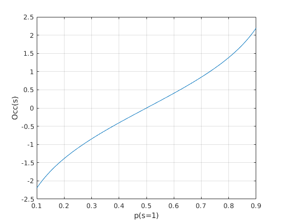
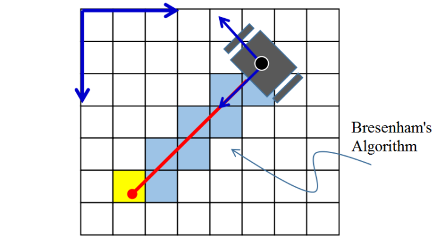

ref: [占据栅格地图-当机器人遇上了学习](https://zhuanlan.zhihu.com/p/21738718)

## 占据栅格地图

- occupancy: 占据率
- occupied state: p(s=1),占据的概率
- free state: p(s=0)
- $Occ(s)=\log Odd(s)=\frac{p(s=1)}{p(s=0)}$, 当前的状态表示

根据新的测量值$z\in [0,1]$,更新当前状态:$Odd(s|z)=\frac{p(s=1|z)}{p(s=0|z)}$.根据贝叶斯公式：

$$ p(s=1|z)=\frac{p(z|s=1)p(s=1)}{p(z)} \\
 p(s=0|z)=\frac{p(z|s=0)p(s=0)}{p(z)}
$$

可以得到：
$$\begin{align} Odd(s|z)&=\frac{p(s=1|z)}{p(s=0|z)} \\
                        &=\frac{p(z|s=1)p(s=1)}{p(z|s=0)p(s=0)}\\
                        &=\frac{p(z|s=1)}{p(z|s=0)}Odd(s)   \\
            Occ(s|z)&=\log Odd(s|z)=log \frac{p(z|s=1)}{p(z|s=0)}+ \log Odd(s)
\end{align}
$$

更具测量值而更新的增量部分称为测量值的模型(Measurement Model),记为lomeas。测量值的模型一般为两个常数：
$$lofree=\log \frac{p(z=0|s=1)}{p(z=0|s=0)},\quad looccu=\log \frac{p(z=1|s=1)}{p(z=1|s=0)}$$

则测量更新规则变为： $S^+=S^-+lomeas$. 在初始状态：
$$S_{init}=Occ(s)=\log \frac{p(s=1)}{p(s=0)}=\log \frac{0.5}{0.5}=0$$

在更新地图中需要把激光检测的障碍物坐标转化为地图离散坐标：
$$(i,j)=(ceil(x/r),ceil(y/r))$$
其中，$i,j$为离散地图坐标，r为离散方格边长。另外障碍物点和激光原点之间的非障碍点也需要更新，可以用Bresenham算法来找到两点之间的中间点。

