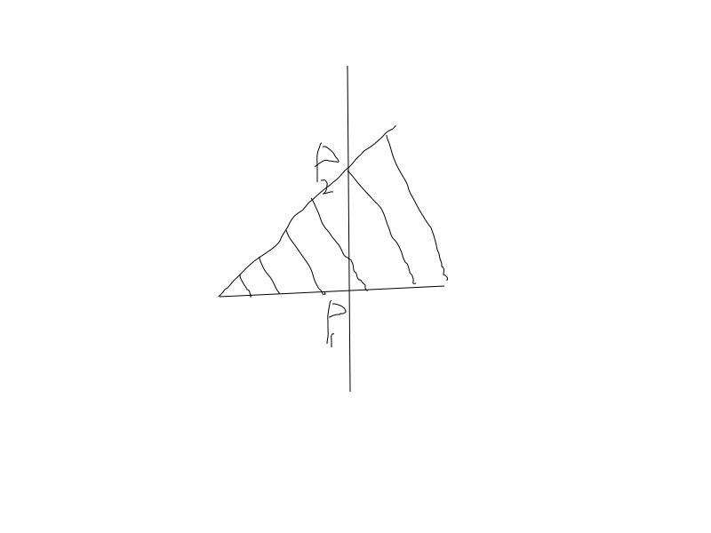
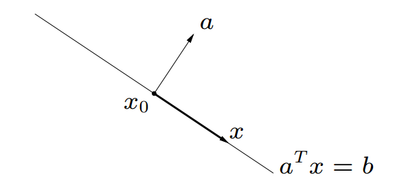
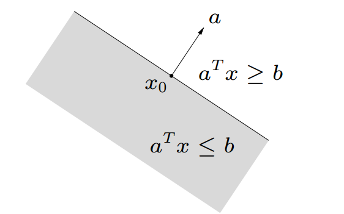
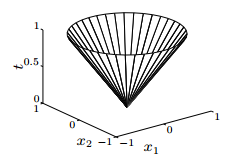
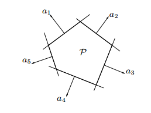

## 直线和线段

记$x_1,x_2\in C$，则直线形式：

$$y=\theta x_1 + (1-\theta)x_2, \theta \in R$$

若$\theta \in [0,1]$则y构成了$x_1$和$x_2$之间的线段。上述直线形式表示了y是基于两个基点所构成的，当$\theta \in [0,1]$y在两点之间变动;当$\theta <0$或$\theta > 1$,y则超出线段，在线段的延伸处。

## 集合的表示

线性组合：

$$y=\sum \lambda_i x_i$$ 

- 仿射集合(Affine set): $\sum \lambda_i=1$
- 凸锥(conic set): $\lambda_i \geq 0$
- 凸集(convex set): $\sum \lambda_i=1, \lambda_i \geq 0 $

一条线也是一个仿射集：$x=\theta x_1 +(1-\theta) x_2$.

线性方程组的解集$C=\{ x| Ax=b \}$是一个仿射集合。反之，任意仿射集合可以表示为一个线性方程组的解集。上式中$A$是一个矩阵，$x,b$都是向量。

$\{ x| a^Tx=b \}$这个集合被称为超平面，a，x是向量b是一个常数。任取$x_0$,使得$a^Tx_0=b$, 则解集上任意点$x$,有$a^T(x-x_0)=0$. 即解集以$x_0$为中心，垂直a的所有的线段形成的平面。或者可以理解为x在a上投影的长度为b，则满足条件的x在垂直于a的某一个平面上，而b决定了这个平面的高度。

$\{a^Tx \leq b \}$ 被成为半空间(halfspace).可以认为是由超平面分割的空间。

超平面是仿射集，也是凸集，半空间是凸集。

上述图形表示，由$OP_1$和$OP_2$形成的锥体就是向量的凸锥，而线段$l1$是仿射集合，两者的交集，即线段$P_1P_2$是凸集。

从集合的角度理解一下优化问题：

$$P=\left\{\mathbf{x} \in \mathbf{R}^{n} \mid \mathbf{A} \mathbf{x}=\mathbf{b}, \mathbf{x} \geq \mathbf{0}\right\}$$

- P是A的列向量组成的超平面相交之后再与凸锥($x\geq 0$)相交的集合
- $\mathbf{A} \mathbf{x}=\mathbf{b}, \mathbf{x} \geq \mathbf{0}$意味着，向量b落入由A的列向量形成的凸锥中。

**sphere, ellisoid**

ball with center $x_c$ and radius r:

$$B\left(x_{c}, r\right)=\left\{x \mid\left\|x-x_{c}\right\|_{2} \leq r\right\}=\left\{x_{c}+r u \mid\|u\|_{2} \leq 1\right\}$$

ellipsoid:

$$\left\{x \mid\left(x-x_{c}\right)^{T} P^{-1}\left(x-x_{c}\right) \leq 1\right\},\quad P\in S^n_{++} \quad \text{symmetric positive definite}$$

or:

$$\left\{x_{c}+A u \mid\|u\|_{2} \leq 1\right\} \text { with } A \text { square and nonsingular }$$

**norm ball, norm cone**

norm ball: $||x-x_c|| \leq r$

norm cone: $||x|| \leq t$. euclidean norm cone is called second-order cone（二阶锥）.

norm ball and norm cone are both convex.

**polyhedra**

多面体： solution set of finitely many linear inequalities and equalities

$$Ax\preceq b, Cx =d$$

**positive semidefinite cone**

$$\begin{aligned}
A \succeq 0 & \Longleftrightarrow A \text { positive semidefinite } \\
A \succ 0 & \Longleftrightarrow A \text { positive definite. }  \\
S^n & \quad \text{set of symmetric n $\times$ x matrics}    \\
S^n_{+} & =\{X\in S^n | X \succeq 0 \}  \quad \text{positive semidefinite $\times$ x matrics}    \\
S^n_{++} & =\{X\in S^n | X \succ 0 \}  \quad \text{positive definite $\times$ x matrics}   
\end{aligned}$$

半正定矩阵组成的集合是一个凸锥。

## Operations that preserve convexity

operations between convex set:

- intersection
- affine functions
- perspective function
- linear-fractional function

vintersection** : $S=\left\{x \in \mathbf{R}^{m}|| p(t) \mid \leq 1 \text { for }|t| \leq \pi / 3\right\}$

**affine function**: $f(x)=Ax+b$, 凸集经过仿射函数变换和逆变换都是凸的。

- scaling
- translation
- projection

**perspective function** $P: \mathbf{R}^{n+1} \rightarrow \mathbf{R}^{n}$ :
$$
P(x, t)=x / t, \quad \operatorname{dom} P=\{(x, t) \mid t>0\}
$$

images and inverse images of convex sets under perspective are convex

**linear-fractional function** $f: \mathbf{R}^{n} \rightarrow \mathbf{R}^{m}$ :
$$
f(x)=\frac{A x+b}{c^{T} x+d}, \quad \operatorname{dom} f=\left\{x \mid c^{T} x+d>0\right\}
$$
images and inverse images of convex sets under linear-fractional functions are convex

## generalized inequalities (广义不等式)

a convex cone $K \subseteq R^n$ is a proper cone(正常锥) if:

- K is closed(contain its boundary)
- K is solid (has nonempty interior)
- K is pointed(contains no line)

**examples**

- 非负象限
- 半正定矩阵 $S^n_{+}$
- $[0,1]$上非负的多项式

$$K=\left\{x \in \mathbf{R}^{n} \mid x_{1}+x_{2} t+x_{3} t^{2}+\cdots+x_{n} t^{n-1} \geq 0 \text { for } t \in[0,1]\right\}$$

由正常锥$K$定义的广义不等式：

$$x \preceq_{K} y \quad \Longleftrightarrow \quad y-x \in K, \quad x \prec_{K} y \quad \Longleftrightarrow \quad y-x \in \operatorname{int} K$$

通过减法操作后其结果属于对应的正常锥。

1. element-wise 不等式： $x \preceq_{\mathbf{R}_{+}^{n}} y \Longleftrightarrow x_{i} \leq y_{i}, \quad i=1, \ldots, n$
2. matrix inequality: $X \preceq \mathbf{S}_{+}^{n} Y \quad \Longleftrightarrow \quad Y-X \text { positive semidefinite }$

a positive  definite matrix A defines a sllipsoid:

$$\mathcal{E}_{A}=\left\{u: u^{T} A u \leq 1\right\}$$

the correspondence between $A$ and $\mathcal{E}_A$ is one-to-one, moreover, $A\succeq B$ if and only if $\mathcal{E}_B$ contains $\mathcal{E}_B$.

## minimum and minimal elements

如果对于每个y， x都广义小于等于y，则x是集合的最小元(minimum element)。

如果若y广义小于等于x都能推出x与y相等， 则x是极小元(minimal element)。(类似极值点)

$x \in S$ is the minimum element of $S$ with respect to $\preceq_{K}$ if
$$
y \in S \quad \Longrightarrow \quad x \preceq_{K} y
$$
$x \in S$ is a minimal element of $S$ with respect to $\preceq_{K}$ if
$$
y \in S, \quad y \preceq_{K} x \quad \Longrightarrow \quad y=x
$$

## separating hyperplane theorem

if $C$ and $D$ are nonempty disjoint convex sets, there exist $a \neq 0, b$ s.t.

$$a^{T} x \leq b \text { for } x \in C, \quad a^{T} x \geq b \text { for } x \in D$$

the hyperplane $\left\{x \mid a^{T} x=b\right\}$ separates $C$ and $D$
strict separation requires additional assumptions (e.g., $C$ is closed, $D$ is a singleton)

