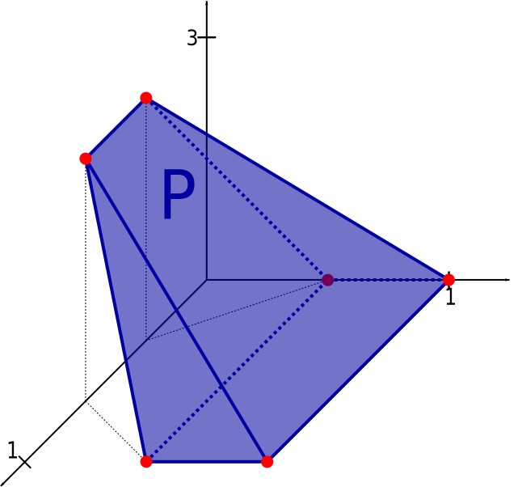

- 线性规划(Linear programming, LP): 目标函数和约束条件都为线性。
- 可行域(feasible domain): 有限顶点的凸多边形(三维中则是多面体)
- 线性规划的最优点总是在多边形的顶点或边
- 历程：
    - 提出 by G. B. Dantzig (1947)
    - simplex method by G. B. Dantzig (1948)
    - Ellipsoid Method proposed by L. G.Khachian (1979)
    - Interior-Point Method proposed by N.Karmarkar (1984)

## 标准型

$$\left\{\begin{array}{c}
\min c^{T} x \\
A x \leq b \\
x \geq 0
\end{array}\right.$$

将任意一个线性变换转化为标准形式：

- 如果目标函数是求max， 乘以-1转化为min
- 如果约束条件是大于等于，则乘以-1转化为小于等于

$$\begin{array}{c}
\min -x_{1}-x_{2} \\
x_{1}-x_{2} \leqslant 0 \\
-1.5 x_{1}+x_{2} \leqslant 0 \\
50 x_{1}+20 x_{2} \leqslant 2000 \\
x_{1}, x_{2} \geq 0
\end{array}$$

## 松驰型（增广矩阵）

$$\left\{\begin{array}{l}
\min {c}^{T} x \\
Ax=b \\
x \geq 0
\end{array}\right.$$

转化为松弛型的过程就是通过引入新的非负松弛变量，使得不等是约束转化为等式约束的过程。

$$\begin{array}{c}
\min -x_{1}-x_{2} \\
x_{1}-x_{2}+x_{3}=0 \\
-1.5 x_{1}+x_{2}+x_{4}=0 \\
50 x_{1}+20 x_{2}+x_{5}=2000 \\
x_{1}, x_{2}, x_{3}, x_{4}, x_{5} \geq 0
\end{array}$$

从集合的角度理解一下优化问题：

$$P=\left\{\mathbf{x} \in \mathbf{R}^{n} \mid \mathbf{A} \mathbf{x}=\mathbf{b}, \mathbf{x} \geq \mathbf{0}\right\}$$

- P是A的列向量组成的超平面相交之后再与凸锥($x\geq 0$)相交的集合
- $\mathbf{A} \mathbf{x}=\mathbf{b}, \mathbf{x} \geq \mathbf{0}$意味着，向量b落入由A的列向量形成的凸锥中。

## 单纯形法(simplex method)
## 椭圆法(Ellipsoid method)
## 内点法(Interior-Point Method)

## ref

- [线性规划的算法分析](https://www.jianshu.com/p/a0fc8a57f452)