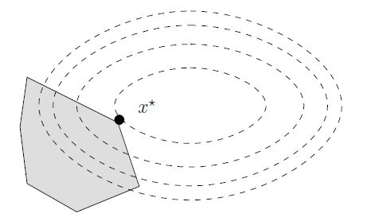
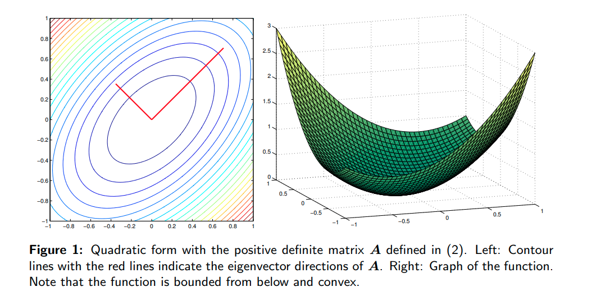
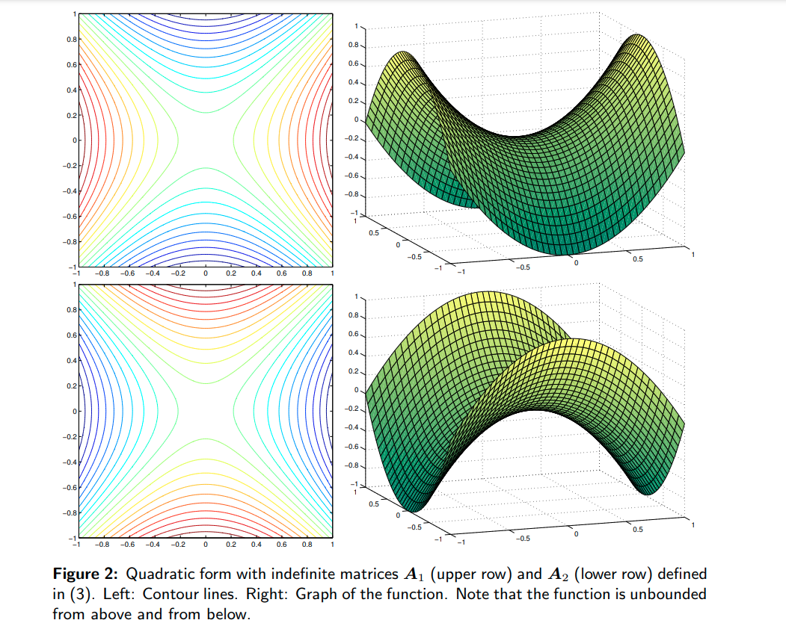
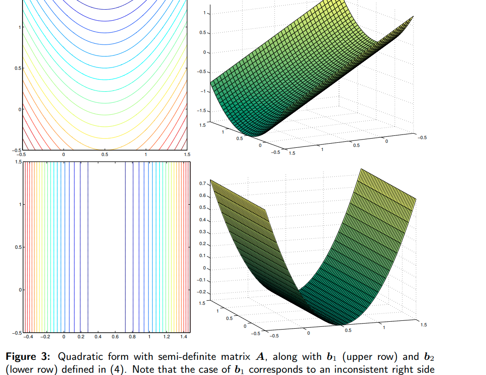

quadratic programming

二次规划的基本形式：

$$\begin{aligned}
&\min f(x)=q^T x+\frac{1}{2} x^T Q x \\
&\text { s.t.Ax }=a \\
&B x \leq b \\
&x \geq 0
\end{aligned}$$

$Q$ 可被认为是目标函数的Hessian matrix.

## 几何视角

- [quadratic forms](https://users.oden.utexas.edu/~omar/inverse_probs/numopt.pdf)
- [geometry of the curves of the contour lines of f(x)=12xtAx+btx+c](https://math.stackexchange.com/questions/2883109/find-the-geometry-of-the-curves-of-the-contour-lines-of-fx-frac12xtax)

1. 相比线性规划，QP的变化是二次引入的等高线(contour line)不再是直线， 这样最优解不再限制在角上，可能是边上或者内部。

[ref](https://optimization.cbe.cornell.edu/index.php?title=Quadratic_programming)

2. 另一个则是非凸情况的产生。凸函数对应的是正定矩阵，非凸对应的是不定矩阵（indefinite）

正定矩阵对应的等高线为椭圆。不定矩阵对应的为双曲线。

.png

**常用求解方法：**

1. 内点法 interior point
2. 激活集法 active set
3. 共轭梯度法 conjugate gradient
4. 椭球法 若Q为正定矩阵，则相应的二次规划问题可由椭球法在多项式时间内求解
5. 增广拉格朗日法 augmented lagrangian
6. 梯度投影法 gradient projection

## 参数特性

1. 如果Q是半正定矩阵，那么f(x)是一个凸函数。相应的二次规划为凸二次规划问题；此时若约束条件定义的可行域不为空，且目标函数在此可行域有下界，则该问题有全局最小值。
2. 如果Q是正定矩阵，则该问题有唯一的全局最小值。
3. 若Q为非正定矩阵，则目标函数是有多个平稳点和局部极小点的NP问题。
4. 如果Q=0，二次规划问题就变成线性规划问题

目标函数和约束条件：

1. Q是不是半正定的
2. 是只有等式约束还是有不等式约束

## 无约束条件

求极值

$$\begin{aligned}
\nabla f &= Qx+q = 0 \\ 
x&=Q^{-1}\cdot -q
\end{aligned}$$

## 等式约束

- 消元法
- 拉格朗日乘子法

## KKT conditions

拉格朗日函数：
$$\begin{aligned}
F(X, \lambda, \mu) = f(x) + \lambda^T (Ax-a)+\mu^T (Bx-b)
\end{aligned}$$
KKT 条件：
$$\begin{aligned}
\nabla_x F(X, \lambda, \mu) &= q + Qx + A^T\lambda+B^T\mu  \\
Ax -a & = 0    \\
Bx - b & \leq 0 \\
\lambda^T \neq 0,& \quad \mu^T \geq 0, \quad x \geq 0
\end{aligned}$$

## 等式约束

kkt条件可以写为：
$$\begin{bmatrix} Q & A^T \\ A & 0  \end{bmatrix} 
\begin{bmatrix} x \\ \lambda  \end{bmatrix} =\begin{bmatrix} -q \\ a  \end{bmatrix} $$

求解变成了解线性方程，在参数规模不大的时候，可以通过矩阵分解求得 $x, \lambda$.

## solution strategy

- only equality constraints: **conjugate gradient method**:
-  inequality constraints: interior point and active set methods
- box constraint $x^L\leq x \leq x^U$: trust-region methods
- all general constraint: NLP solver

## 对偶性

## ref

- blog
    - [Quadratic_programming](https://optimization.mccormick.northwestern.edu/index.php/Quadratic_programming)
    - [一步一步走向锥规划 - QP](https://zhuanlan.zhihu.com/p/83841138)
- pdf / book / notes
    - [Chapter3](https://www.math.uh.edu/~rohop/fall_06/Chapter3.pdf)