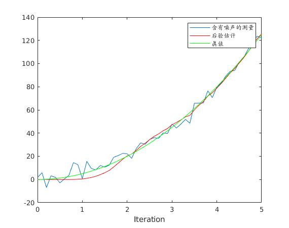

---
title: kalman filter
categories: optimization
tags: optimization
date: 2019-07-12
---

**matlab 例程**



```matlab
clc
clear all
close all

% 初始化参数
delta_t=0.1;   %采样时间
t=0:delta_t:5;
N = length(t); % 序列的长度
sz = [2,N];    % 信号需开辟的内存空间大小  2行*N列  2:为状态向量的维数n
g=10;          %加速度值
x=1/2*g*t.^2;      %实际真实位置
z = x + sqrt(10).*randn(1,N); % 测量时加入测量白噪声

Q =[0 0;0 9e-1]; %假设建立的模型  噪声方差叠加在速度上 大小为n*n方阵 n=状态向量的维数
R = 10;    % 位置测量方差估计，可以改变它来看不同效果  m*m      m=z(i)的维数

A=[1 delta_t;0 1];  % n*n
B=[1/2*delta_t^2;delta_t];
H=[1,0];            % m*n

n=size(Q);  %n为一个1*2的向量  Q为方阵
m=size(R);

% 分配空间
xhat=zeros(sz);       % x的后验估计
P=zeros(n);           % 后验方差估计  n*n
xhatminus=zeros(sz);  % x的先验估计
Pminus=zeros(n);      % n*n
K=zeros(n(1),m(1));   % Kalman增益  n*m
I=eye(n);

% 估计的初始值都为默认的0，即P=[0 0;0 0],xhat=0
for k = 9:N           %假设车子已经运动9个delta_T了，我们才开始估计
    % 时间更新过程
    xhatminus(:,k) = A*xhat(:,k-1)+B*g;
    Pminus= A*P*A'+Q;
    
    % 测量更新过程
    K = Pminus*H'*inv( H*Pminus*H'+R );
    xhat(:,k) = xhatminus(:,k)+K*(z(k)-H*xhatminus(:,k));
    P = (I-K*H)*Pminus;
end
 
figure
plot(t,z);
hold on
plot(t,xhat(1,:),'r-')
plot(t,x(1,:),'g-');
legend('含有噪声的测量', '后验估计', '真值');
xlabel('Iteration');
```