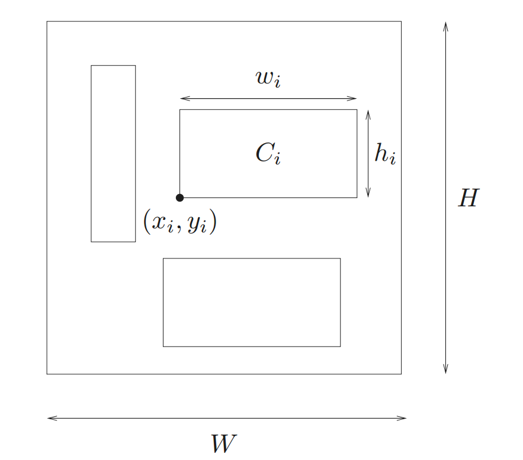

## what is

- geometric programming: 几何规划
- polynomials: [数]多项式（polynomial 的复数形式）
- monomials: 单项式

In the context of geometric programming a monomial is a function from $\mathbb{R}^n_{++}\rightarrow \mathbb{R}$ defined as:

$$g(x) = c x_1^{a_1} x_2^{a_2} ... x_n^{a_n}$$

where $c>0, a_i\in \mathbb{R}$. Such as :

$$7x \qquad   4xy^2z  \qquad  \frac{2x}{y^2z^{0.3}}  \qquad  \sqrt{2xy}$$

Building on this, a posynomial is defined as a sum of monomials:

$$f(x) = \sum_{k=1}^K c_k x_1^{a_1k} x_2^{a_2k} ... x_n^{a_nk}$$

Such as:

$$x^2 + 2xy + 1  \qquad  7xy + 0.4(yz)^{-1/3}  \qquad  0.56 + \frac{x^{0.7}}{yz}$$

A geometric program (GP) is an optimization problem of the form

$$
\begin{array}{ll}
\operatorname{minimize} & f_0(x) \\
\text { subject to } & f_i(x) \leq 1, \quad i=1, \ldots, m \\
& g_i(x)=1, \quad i=1, \ldots, p,
\end{array}
$$

where $f_0, \ldots, f_m$ are posynomials and $g_1, \ldots, g_p$ are monomials. Some GP programming example:

$$\begin{split}\begin{array}{llll}\text{}
\text{minimize} & x^{-1}y^{-1/2}z^{-1} + 2.3xz + 4xyz \\
\text{subject to} & (1/3)x^{-2}y^{-2} + (4/3)y^{1/2}z^{-1} \leq 1 \\
                  & x + 2y + 3z \leq 1 \\
                  & (1/2)xy = 1
                  \end{array}\end{split}$$

Another example, floor planning:

$$
\begin{aligned} \min_{W,H,x,y,w,h } \quad & WH \\\text{subject to} \quad &0\leq x_{i}\leq W,\ i=1,\cdots n\\ &0\leq y_{i}\leq H,\ i=1,\cdots n\\  &x_{i}+w_{i}\leq x_{j},\ (i,j)\in \mathcal{L} \\ & y_{i}+h_{i}\leq y_{j},\ (i,j)\in \mathcal{B}  \\ & w_{i}h_{i}=C_{i},\ i=1,\cdots n.\end{aligned} 
$$

## Convex form

Any GP can be made convex by means of a change of variables. Given $g(x) = c x_1^{a_1} x_2^{a_2} ... x_n^{a_n}$, let $y_i = \log x_i$, and rewrite this as:

$$c (e^{y_1})^{a_1} (e^{y_2})^{a_2} ... (e^{y_n})^{a_n} = e^{a^Ty+b}, b = \log c$$

Also, a polynominal can be written as $\sum^p_{k=1} e^{a_k^Ty + b_k}$. With this variable substitution, and after taking logs, a geometric program is equivalent to

$$\begin{aligned}
\min_y & \quad \log(\sum^{p_0}_{k=1}e^{a_{0k}^Ty+b_{0k}}) \\
\text{subject to} ~& \quad \log(\sum^{p_i}_{k=1}e^{a_{ik}^Ty+b_{ik}}) \leq 0, i=1, \cdots, m \\
&\quad c^T_{j}y+d_j = 0, j=1,\cdots r
\end{aligned}$$

This is convex, recalling the convexity of soft max functions. This log-log transformation can be used to convert a larger class of problems, known as log-log convex programming (LLCP), into an equivalent convex form.

