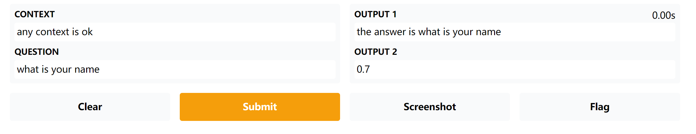

gradio: Build & Share Delightful Machine Learning Apps

快速部署模型推理前端

## A simple text2text demo

```python
import gradio as gr
def question_answer(context, question):
    return ("the answer is {}".format(question), 0.7)

gr.Interface(fn=question_answer, inputs=["text", "text"], outputs=["textbox", "text"]).launch()
```


