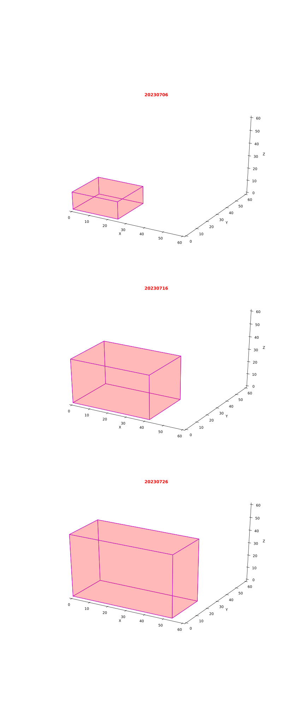

```python
'''
plot 3d cube
'''
import numpy as np
import matplotlib.pyplot as plt
from mpl_toolkits.mplot3d import Axes3D, art3d

def plot_block(x, y, z, width, height, depth, color):
    v = np.array([
        [x, y, z],
        [x + width, y, z],
        [x + width, y + height, z],
        [x, y + height, z],
        [x, y, z + depth],
        [x + width, y, z + depth],
        [x + width, y + height, z + depth],
        [x, y + height, z + depth]
    ])

    # Define the 6 faces of the block
    f = np.array([
        [0, 1, 2, 3], [4, 5, 6, 7], [0, 1, 5, 4],
        [2, 3, 7, 6], [0, 3, 7, 4], [1, 2, 6, 5]
    ])

    pc = art3d.Poly3DCollection(v[f], facecolors=color, linewidths=1, alpha=0.15, edgecolors='m')
    return pc


color = [0.6, 0.6, 0.6, 0.5]
fig = plt.figure(figsize=(12,28))

var = [
    [25,23,14],
    [42,29,35],
    [54,24,49],
]
max_x = 60
var_len = len(var)
titles = ["20230706", "20230716", "20230726"]
for i in range(var_len):
    ax = fig.add_subplot(var_len,1,i+1, projection='3d')
    pc = plot_block(0.0,0.0,0.0,*var[i],'red')
    ax.add_collection(pc)
    ax.set_xlabel('X')
    ax.set_ylabel('Y')
    ax.set_zlabel('Z')
    ax.grid(False)
    ax.set_title(titles[i], color= 'red', fontweight='bold', fontsize=12)
    # ax.set_box_aspect([1.0, 1.0, 1.0])
    ax.set_xlim3d(0, max_x)
    ax.set_ylim3d(0, max_x) 
    ax.set_zlim3d(0, max_x) 
    ax.xaxis.pane.fill = False
    ax.yaxis.pane.fill = False
    ax.zaxis.pane.fill = False
    ax.xaxis.pane.set_edgecolor('w')
    ax.yaxis.pane.set_edgecolor('w')
    ax.zaxis.pane.set_edgecolor('w')

plt.savefig('body_volume.svg')
plt.savefig('body_volume.png')
plt.show()
```