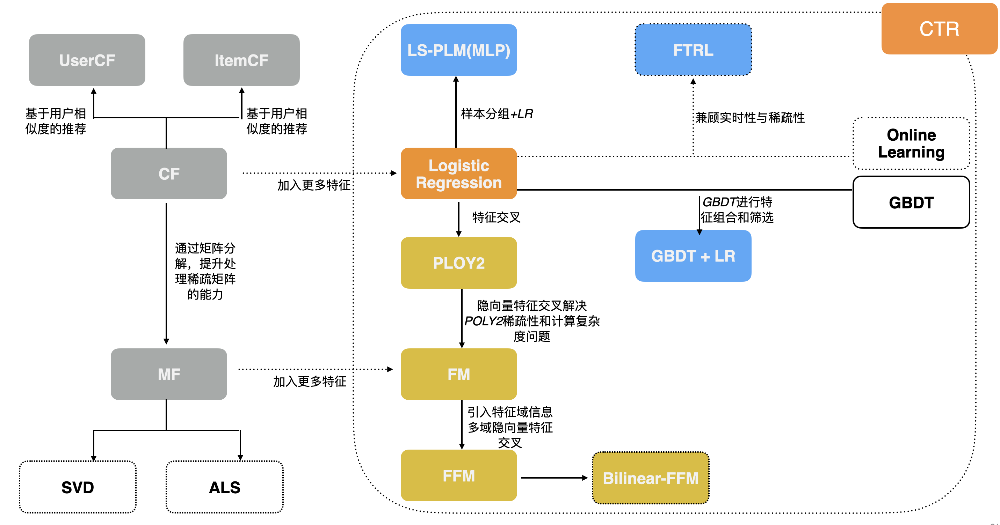
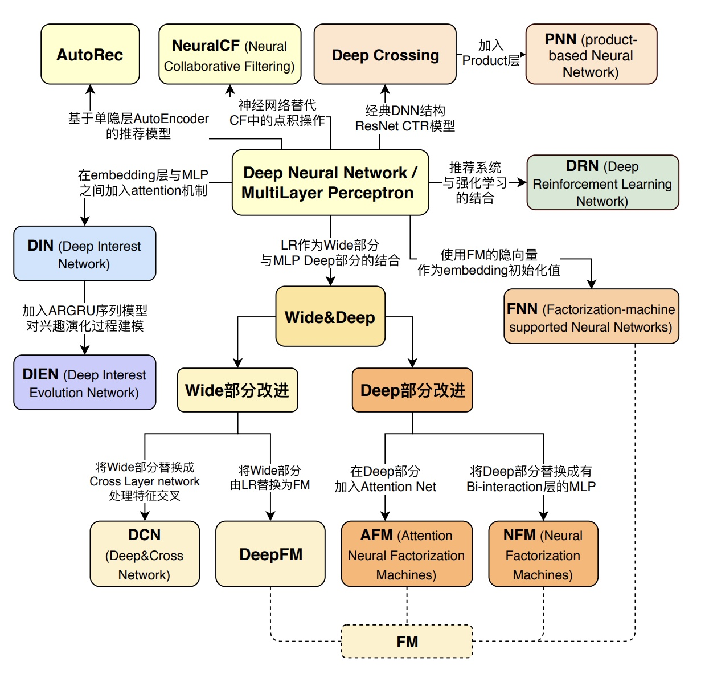

推荐与CTR预估的区别

推荐与计算广告的区别

排序与CTR的区别

应用场景：

- 资讯： 今日头条，腾讯新闻
- 电商：淘宝，京东，亚马逊
- 社交： 微信，facebook
- 娱乐：抖音，快手，爱奇艺，Bilibili
- 生活服务：美团，大众点评，携程

##  推荐系统的进化脉络

**传统推荐系统演化关系**

1. 协同过滤
    - UserCF具有较强的社交属性，故适于新闻推荐等及时性，热点性的领域。ItemCF更适用于兴趣变化较为稳定的领域，比如电商。
    - 协同过滤头部效应明显，处理稀疏向量能力弱。仅利用交互信息，无法表示更深层次的表达。
2. 矩阵分解
    - 由于隐向量的提出，泛化能力比协同过滤增强，空间复杂度降低
    - 但是矩阵分解人然只利用了交互信息，所以依然存在冷启动问题，并且无法利用更丰富的上下文信息
3. 逻辑回归
    - 逻辑回归开始考虑加入丰富的特征，并且把交互信息作为训练目标，有比协同过滤更加泛化的能力。并且计算简单，直观，易用。
    - 但是没有进行特征交叉。
4. FM系列
    - 开始引入特征交叉，表达能力更强
5. GBDT+LR
    - 高维特征组合和筛选， 推进特征工程模型化（实现特征的端到端生成）
    - 以树模型进行初步特征抽取，以线性模型进行进一步分类的概念

**深度推荐系统演化关系**

## 推荐系统架构

为什么不直接使用召回得分进行排序：
1. 多路精召回队列，得分不具有可比性
2. 候选集变小，可以负担得起更复杂的模型

## 会议&PAPER

RecSys | SIGIR | KDD

RS(Recommender System)：RecSys

IR (Information Retrieval): SIGIR

DM(Data Mining): SIGKDD,ICDM, SDM

ML (Machine Learning): ICML, NIPS

CV (Computer Vision): ICCV, CVPR, ECCV

MM (MultiMedia): ACM MM

DB (Database): CIKM, WIDM

AI (Artificial Intelligence): IJCAI, AAAI

## blog

- [知乎专栏-推荐系统与NLP](https://www.zhihu.com/column/c_1068100809786458112)
- [推荐系统/计算广告/机器学习/CTR预估资料汇总](https://awesomeopensource.com/project/mJackie/RecSys)
- [知乎专栏 - 深度推荐系统](https://www.zhihu.com/column/deep-recsys)
- [知乎专栏 - 深度学习强化学习推荐算法](https://www.zhihu.com/column/c_1122565407583678464)
- [知乎专栏 - 王喆的机器学习笔记](https://zhuanlan.zhihu.com/wangzhenotes)
- [知乎专栏 - 推荐算法学习笔记](https://www.zhihu.com/column/c_1223287189188190208)
- [知乎专栏 - 推荐系统打怪升级之路](https://www.zhihu.com/column/c_1112294571937193984)
- [知乎专栏 - 推荐系统实验室](https://www.zhihu.com/column/wangziji)
- [推荐系统理论及实战](https://www.jianshu.com/nb/21403842)
- [Recommendation System Series Part 2: The 10 Categories of Deep Recommendation Systems That Academic Researchers Should Pay Attention To](https://towardsdatascience.com/recommendation-system-series-part-2-the-10-categories-of-deep-recommendation-systems-that-189d60287b58)
- [readingList](https://github.com/DeepGraphLearning/RecommenderSystems/blob/master/readingList.md)
- [计算广告论文、学习资料、业界分享](https://github.com/wzhe06/Ad-papers)

## personal code

- [ant-learn-recsys](https://github.com/peiss/ant-learn-recsys/tree/08f8df7d158706716e9323424f8085d01b047366)

## open project

- [LightGBM](https://github.com/Microsoft/LightGBM): A fast, distributed, high performance gradient boosting (GBT, GBDT, GBRT, GBM or MART) framework
- [xgboost](https://github.com/dmlc/xgboost): Scalable, Portable and Distributed Gradient Boosting (GBDT, GBRT or GBM) Library
- [LIBFFM]()
- [XLearn](https://github.com/aksnzhy/xlearn)
- [DeepCTR](https://github.com/shenweichen/DeepCTR)
- [DeepMatch](https://github.com/shenweichen/DeepMatch)
- [MatchZoo](https://github.com/NTMC-Community/MatchZoo)
- [dlrm](https://github.com/facebookresearch/dlrm)
- [librec-java]

## open cource

- [youtube Recommender Systems by Andrew Ng](https://www.youtube.com/watch?v=giIXNoiqO_U&list=PL-6SiIrhTAi6x4Oq28s7yy94ubLzVXabj)
