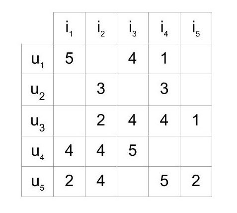
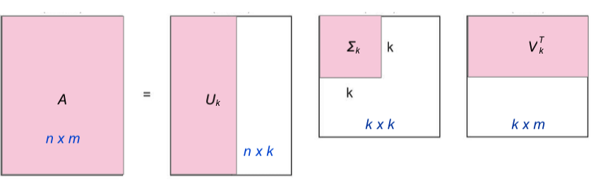

## 推荐系统方法

- 基于人口统计学(Demographic based)：用户特征，比如年龄，性别，学历等。领域独立(domain-independent)
- 基于内容: 内容的源数据特征
- 协同过滤(collaborative filtering):
    - user-based(UserCF): 喜欢相同物品的用户趋向于喜欢新的相同的物品
    - item-based(ItemCF): 被相同用户喜欢的商品趋向于被新的相同用户喜欢
    - model-based: 矩阵分解，聚类，回归，神经网络。冷启动：即对新用户和新物品需要时间积累

推荐系统的两大场景： 评分预测(rating prediction)和topn推荐(item recommendation, item ranking)

打分矩阵，评分预测任务中表示了user和item间的选择关系。以此为基础理解协同过滤。

## memory-based

user-based (or item-based):

- 计算用户间的相似度：

$$\operatorname{sim}\left(u, u^{\prime}\right)=\cos (\theta)=\frac{\mathbf{r}_{u} \mathbf{r}_{u^{\prime}}}{\left|\mathbf{r}_{u}\right|\left|\mathbf{r}_{u^{\prime}}\right|}=\sum_{i} \frac{r_{u i} r_{u^{\prime} i}}{\sqrt{\sum_{i} r_{u i}^{2}} \sqrt{\sum_{i} r_{u^{\prime} i}^{2}}}$$

- 根据相似度计算新用户的打分,当然这里也可以选取topk相似的用户进行打分

$$\hat{r}_{u i}=\frac{\sum_{u^{\prime}} \operatorname{sim}\left(u, u^{\prime}\right) r_{u^{\prime} i}}{\sum_{u^{\prime}}\left|\operatorname{sim}\left(u, u^{\prime}\right)\right|}$$

- Bias-subtracted Collaborative Filtering: 参考当前用户的打分倾向进行预测

$$\hat{r}_{u i}=\overline{r_{u}}+\frac{\sum_{u^{\prime}} \operatorname{sim}\left(u, u^{\prime}\right)\left(r_{u^{\prime} i}-r_{u^{\prime}}^{-}\right)}{\sum_{u^{\prime}}\left|\operatorname{sim}\left(u, u^{\prime}\right)\right|}$$

缺点：
    - 冷启动问题

## model-based cf

- knn
- matrix factorization(MF)
    - svd 
    - probabilistic matrix factorization(PMF)
    - Non-negative factorization(NMF)
- deep learning
    - deepfm...
    - embedding

## 矩阵分解

**svd 分解**

把打分矩阵当作一个大矩阵，并进行SVD分解，但是只保留部分奇异值进行预测：

$$R=U\Sigma V^T\\
A=U_k\Sigma_k V_k^T\approx R $$

$$ \text{预测： } r_{i,j}=U_k\Sigma_k^{-1/2}(i) \cdot \Sigma_k^{-1/2} V_k^T(j) \\
\text{用户隐向量矩阵：} P=U_k\Sigma_k^{-1/2}\\
\text{物品隐向量矩阵：} Q=\Sigma_k^{-1/2} V_k^T(j)$$

事实上隐向量矩阵可以看作是对用户和物品向量化的编码，即挖掘用户和物品在多个维度下的隐藏特征。

**FunkSVD**

既然矩阵分解的目的可以看作是得到隐向量的过程，则可以把矩阵分解转化为一个优化问题，直接初始化该隐向量，并通过迭代优化寻找满足得分矩阵的最优的隐向量。

$$\mathbf{R} \approx \mathbf{P} \times \mathbf{Q}^{T}=\hat{\mathbf{R}}  \\
\hat{r}_{i j}=p_{i}^{T} q_{j}=\sum_{k=1}^{k} p_{i k} q_{k j}$$

根据R矩阵中已知的得分，计算损失：

$$\min e_{i j}^{2}=\sum(r_{i j}-\hat{r}_{i j})^{2}=\sum(r_{i j}-\sum_{k=1}^{K} p_{i k} q_{k j})^{2}$$

正则化：

$$\min e_{i j}^{2}=\sum(r_{i j}-\sum_{k=1}^{K} p_{i k} q_{k j})^{2} +\lambda(||p_{ik}||^2+||q_{kj}||^2) \\
\text{or add the bias term} \\
\min_{p,q,b_u,b_i} e_{i j}^{2}=\sum(r_{i j}-(\sum_{k=1}^{K} p_{i k} q_{k j}+\mu+b_u+b_i)^{2} +\lambda(||p_{ik}||^2+||q_{kj}||^2+b_u^2+b_i^2)$$

## ref

- blog:
    - [intro-to-collaborative-filtering](https://www.ethanrosenthal.com/2015/11/02/intro-to-collaborative-filtering/)
- personal code
    - [RecSys-项亮的《推荐系统实践》的代码实现](https://github.com/qcymkxyc/RecSys)

