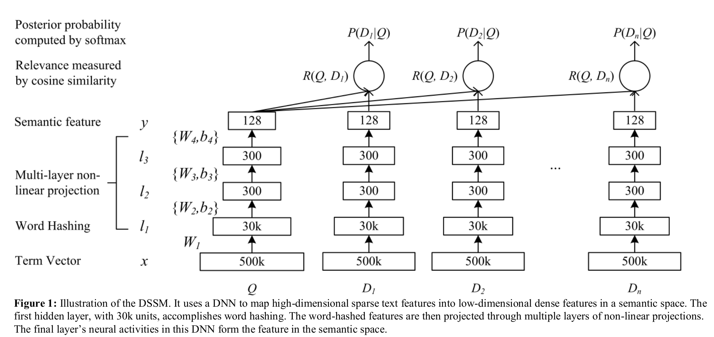
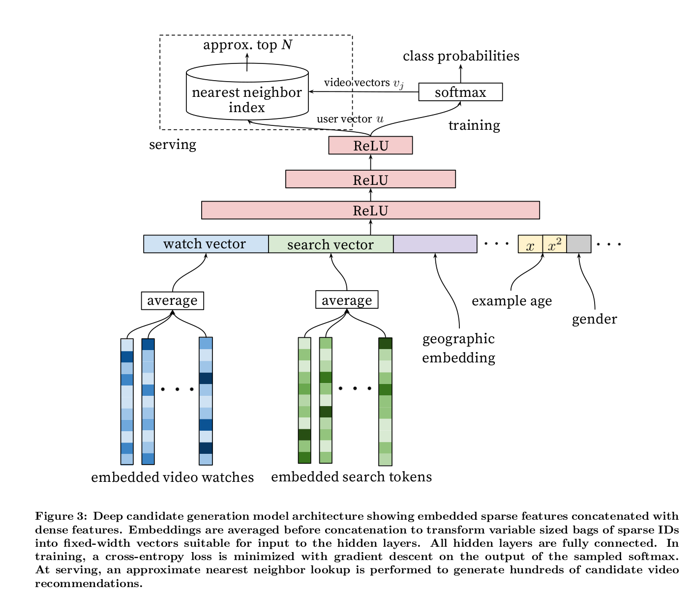
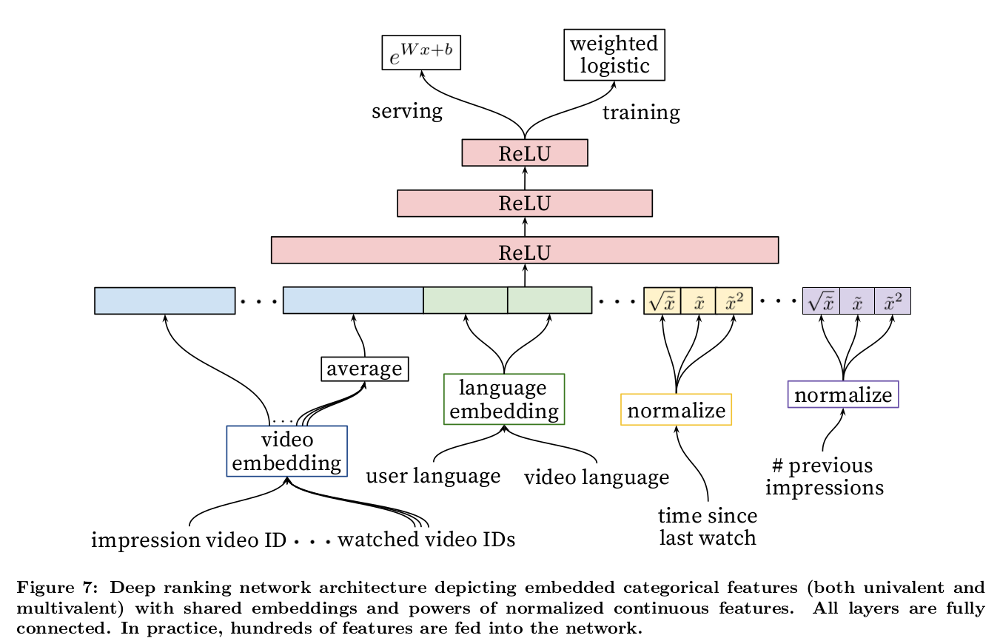
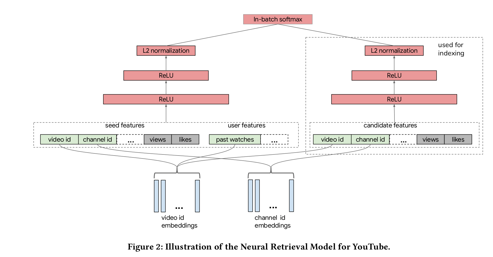
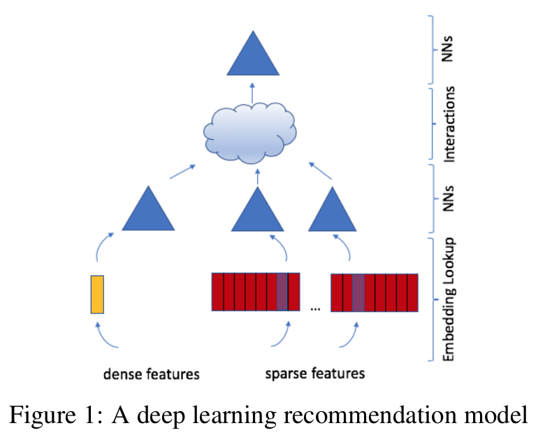
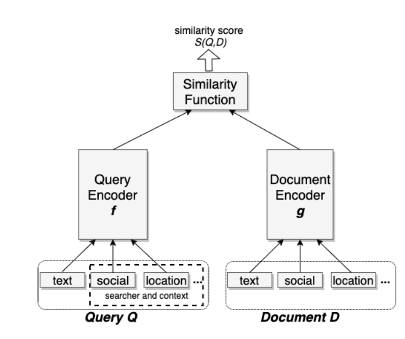

- 2013 dssm microsoft
- 2016 item2vec

## 2013 dssm microsoft

网络结构： 

- input: query/doc 都统一转化为单词，再把单词转化为n-gram，两者网络结构相同，只是训练的权重不同
- 中间处理：
    - term vector: 500k, 单词树；bang，表示单词的one-hot编码
    - word hashing: 通过n-gram降维，good-> #good# -> #go, goo,ood,od#, 这样500k个单词变为30
    k个term
- 训练：
    - 内积; softmax 概率; tanh activation function
    $$P(D \mid Q)=\frac{\exp (\gamma R(Q, D))}{\sum_{D^{\prime} \in D} \exp \left(\gamma R\left(Q, D^{\prime}\right)\right)} \\
    L(\Lambda)=-\log \prod_{\left(Q, D^{+}\right)} P\left(D^{+} \mid Q\right)    $$
    - 通过所有的doc计算softmax，而只对正样本进行四然估计
        - 正样本$D^+$： 当前query被点击的doc
        - 负样本$D^-$： 当前query未被点击的doc，这里只随机取了4个来代替
        - 样本集合$D=D^+ \cup D^-$：这里用部分来代表整体 
- 总结：
    - 优点：
        - 解决字典爆炸
        - n-gram的泛化能力，更好的处理新词
        - 使用有监督的方法
    - 缺点：
        - wordhashing出现hash冲突
        - 词袋，损失了语序，后期变种CNN-DSSM， LSTM-DSSM
        - 曝光量会影响用户的点击，全部用点击作为政府样本容易出现噪声
    - 变种：通过卷积或者rnn捕捉时序信息
        - lstm-dssm
        - cnn-dssm: A latent semantic model with convolutional-pooling structure for information retrieval
        - mv-dssm: multi-view dssm, A multi-view deep learning approach for cross domain user modeling in recommendation systems

## 2016 item2vec

Item2Vec: Neural Item Embedding for Collaborative Filtering

原始优化目标：

$$\frac{1}{K} \sum_{i=1}^{K} \sum_{-c \leq j \leq c, j \neq 0} \log p\left(w_{i+j} \mid w_{i}\right)\\
p\left(w_{j} \mid w_{i}\right)=\frac{\exp \left(u_{i}^{T} v_{j}\right)}{\sum_{k \in I_{W}} \exp \left(u_{i}^{T} v_{k}^{T}\right)}$$

借鉴了skip-gram中的负采样, 优化目标函数退化为:

$$p\left(w_{j} \mid w_{i}\right)=\sigma\left(u_{i}^{T} v_{j}\right) \prod_{k=1}^{N} \sigma\left(-u_{i}^{T} v_{k}\right)\\
\sigma(x)=1 / 1+\exp (-x)$$

to overcome the imbalance between rare and frequent words the following subsampling procedure is proposed：

$$p(\text {discard} \mid w)=1-\sqrt{\frac{\rho}{f(w)}}$$

ref: 
- [1] Mikolov T, Sutskever I, Chen K, Corrado GS, Dean J. Distributed representations of words and phrases and their compositionality. In Advances in neural information processing systems 2013 (pp. 3111-3119).

## 2016 youtube dnn

Deep Neural Networks for YouTube Recommendations

- 数据：
    - 特征选择： 把看过的视频作为用户的特征
    - 历史视频id，50个id+50次搜索， share embedding
    - example age, fresh
    - 特征丰富：$x,\sqrt(x),x^2$
- model：
    - candidate model: recall， 考虑根据内积进行最近邻搜索
    - ranking model: rank, 考虑更加丰富的特征
- train:
    - ann召回
    - softmax多分类
    - 负采样： 选取一部分样本来代表整体

## 2018 alibaba tdm

## 2019 youtube 

Sampling-Bias-Corrected Neural Modeling for Large Corpus Item Recommendations

分别构建query和item端参数结构，通过内积进行embedding:

$$s(x, y)=\langle u(x, \theta), v(y, \theta)\rangle$$

treated as multi-class classification, $r_i$ is the reward:

$$\mathcal{P}(y \mid x ; \theta)=\frac{e^{s(x, y)}}{\sum_{j \in[M]} e^{s\left(x, y_{j}\right)}} \\
L_{T}(\theta):=-\frac{1}{T} \sum_{i \in[T]} r_{i} \cdot \log \left(\mathcal{P}\left(y_{i} \mid x_{i} ; \theta\right)\right)$$

负采样，选用部分来代表整体。从视频榴中选择的话，较热门的视频有更高的概率被作为负样本，所以引入log修正：

$$s^{c}\left(x_{i}, y_{j}\right)=s\left(x_{i}, y_{j}\right)-\log \left(p_{j}\right)$$

With the correction, we have

$$\mathcal{P}_{B}^{c}\left(y_{i} \mid x_{i} ; \theta\right)=\frac{e^{s^{c}\left(x_{i}, y_{i}\right)}}{e^{s^{c}\left(x_{i}, y_{i}\right)+\sum_{j \in[B], j \neq i} e^{s^{c}\left(x_{i}, y_{j}\right)}}}$$

the batch loss function

$$L_{B}(\theta):=-\frac{1}{B} \sum_{i \in[B]} r_{i} \cdot \log \left(\mathcal{P}_{B}^{c}\left(y_{i} \mid x_{i} ; \theta\right)\right)$$

Running SGD with learning rate $\gamma$ yields the model parameter update as

$$\theta \leftarrow \theta-\gamma \cdot \nabla L_{B}(\theta)$$
$$\theta \leftarrow \theta-\gamma \cdot \nabla L_{B}(\theta)$$

- perspectives of data
- model architecture: nomination/retrival/candidate  rank
- training
- serving

## 2019-baidu-mobius

ref:

- [浅谈百度新一代query-ad 推荐引擎如何提升广告收益率]
- [MOBIUS 百度凤巢广告系统最新论文]

mobius

## 2019 facebook dlrm

Deep Learning Recommendation Model for Personalization and Recommendation Systems

- model structure:
    - embedding: 
        - categorical feature -> embedding vector
        - dense feature -> concat -> MLP generate the same length vector
    - nn: MLP
    - interactions: 所有特征向量点积，跟原始向量拼接
    - nn: FC layer
- improvement: parallelism
- 与dcn对比

MLP: multilayer perceptron

FC: fully connected

open code: [github-dlrm](https://github.com/facebookresearch/dlrm)

## 2020-zhihu Beyond Lexical: A Semantic Retrieval Framework for Textual Search

## 2020-JD

- [JD 个性化语义召回](https://zhuanlan.zhihu.com/p/149058532)

- attention,multi-head 向量而不是单一向量
- 样本构建：用户点击的噪声

## 2020-facebook-embedding based retrieval in facebook search

ebr: embedding-based retrieval, 语义检索/向量召回

unified embedding: 对各种特征的embedding，用以区分text embedding

0. triplet loss:

$$L=\sum_{i=1}^{N} \max \left(0, D\left(q^{(i)}, d_{+}^{(i)}\right)-D\left(q^{(i)}, d_{-}^{(i)}\right)+m\right)$$

1. 正负样本的选择
    - 点击作为正样本，随机从候选集中选择负样本
    - 负样本： 1. 随机选取; 2. 同一session中只曝光未点击的作为负样本。只用第二种效果会比较差，具体实践需要结合。
    - 正样本： 1. 选择点击; 2. 选择曝光作为正样本。实践结果发现差不多。paper中采用了点击。有笔者认为应该选择曝光，因为召回模型的结果本来就是用来曝光的。但本人认为在当前排序不好的情况下，选择点击是最好的正样本。
2. 特征工程
    - 文本特征: character n-gram + word n-gram + hash 降维
    - 地域特征: city/region/country/language
    - 社交特征: trained a seperate embedding model based on the Facebook social graph
3. later-stage optimization: 由于模型依据的是历史结果，新召回的item难以在精派的过程中得到重视
    - embedding as ranking feature:
    - training data feedback loop
4. hard mining
    - hard negative mining: 观察到在召回的结果中目标结果与其他结果的得分并没有特别的优势。原因在于随机选取的负样本与正样本差别本就太大导致很容易被区分，不能在训练中获得较好的优化方向。解决办法是可以选择与正样本较为接近的样本作为负样本，增加区分性。
        - onLine hard negative mining：在每一个min-batch的训练批次中选择其他query对应的正样本作为本次训练集中的负样本
        - offline hard negative mining: 
            - hard selection strategy: 迭代召回，每次选则排序在后面的（101-500）作为负样本
            - retrival task optimization: 
                - mixed easy/hard training: easy-hard=100-1
                - transfer learning from hard model to easy:
    - hard positive mining: 从session日志中挖掘没有被点击的正样本
5. ref:
    - [zhihu-Embedding-based Retrieval in Facebook Search](https://zhuanlan.zhihu.com/p/152570715)
    - [负样本为王：评Facebook的向量化召回算法](https://zhuanlan.zhihu.com/p/165064102)

## ref

1. blog
    - [论文｜从DSSM语义匹配到Google的双塔深度模型召回和广告场景中的双塔模型思考](https://zhuanlan.zhihu.com/p/166469248)
    - [实践DSSM召回模型](https://zhuanlan.zhihu.com/p/136253355)
    - [推荐系统中不得不说的DSSM双塔模型](https://zhuanlan.zhihu.com/p/139541282)
    - [DSSM|基于Transformer的语义相似度计算模型DSSM及代码开源](https://blog.csdn.net/qq_28385535/article/details/92803375)
    - [推荐召回算法之深度召回模型串讲](https://zhuanlan.zhihu.com/p/63343894)
    - [Recommender Systems: The Most Valuable Application of Machine Learning](https://towardsdatascience.com/recommender-systems-the-most-valuable-application-of-machine-learning-part-1-f96ecbc4b7f5)
2. paper
    - [2019-facebook-dlrm](Deep Learning Recommendation Model for Personalization and Recommendation Systems)
    - ig2vec :instagram, instagrams explore recommender system
    - [airbnb]()
3. personal code
    - [dssm](https://github.com/InsaneLife/dssm)
    - [DSSM-Pytorch](https://github.com/ChrisCN97/DSSM-Pytorch)
    - [dssm](https://github.com/baharefatemi/DSSM)
    - [two_tower_recommendation_system](https://github.com/cdj0311/two_tower_recommendation_system)

