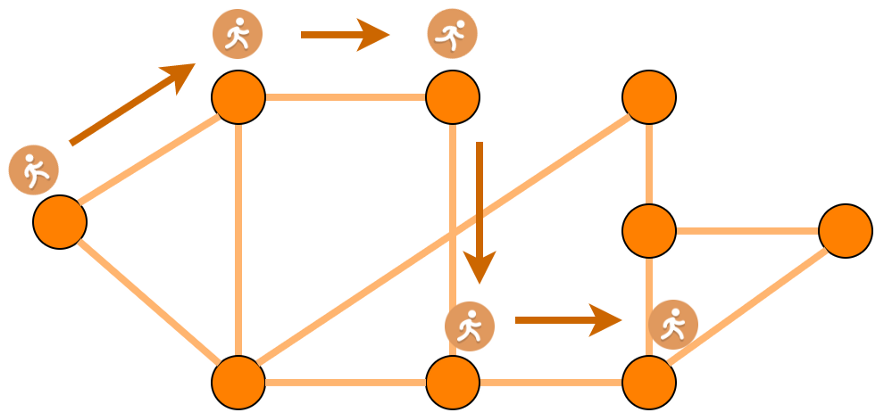

## index

- [2014-deep walk]
- [2016 KDD node2vec](## 2016 KDD node2vec)

## 2016 KDD node2vec

- [offcial site](https://snap.stanford.edu/node2vec/)

## 2014 Deep Walk

random walks：

two stages:

- random walk generator
    - 通过随机游走产生$k$个长度为$l$的节点序列作为候选节点集合
    - 根据假设"Adjacent nodes are similar and should have similar embeddings",每一个节点序列应该有相近的向量表达
    - 方便并行化
- skipgram algorithm
    - 对于给定的语料，skipgram假设在一定大小窗口内的词应该有更相近的向量表达，这一窗口也叫做上下文
    - 对应到deepwalk，在第一步生成的节点序列可以认为是一个上下文窗口，因此可以用同样的方法来训练，即用当前节点预测上下文窗口内的节点
- optimization
    - Hierarchical Softmax
    - Parallelizability with asynchronous version of stochastic gradient descent (ASGD)
- variants
    - srtreaming
    - non-random walks

## ref 

- blog
- personal code
- paper
- project
