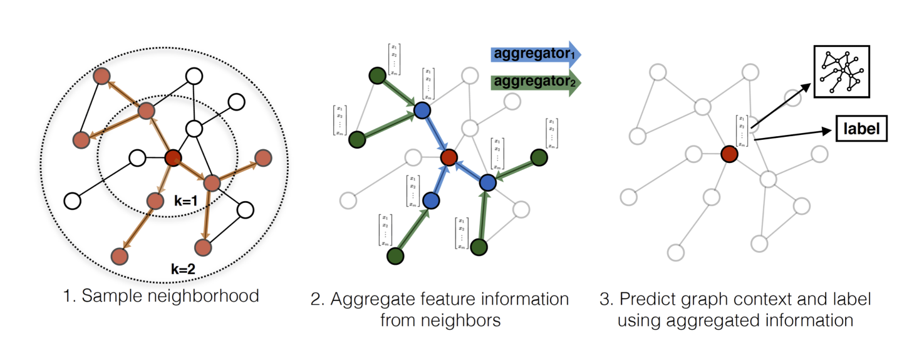
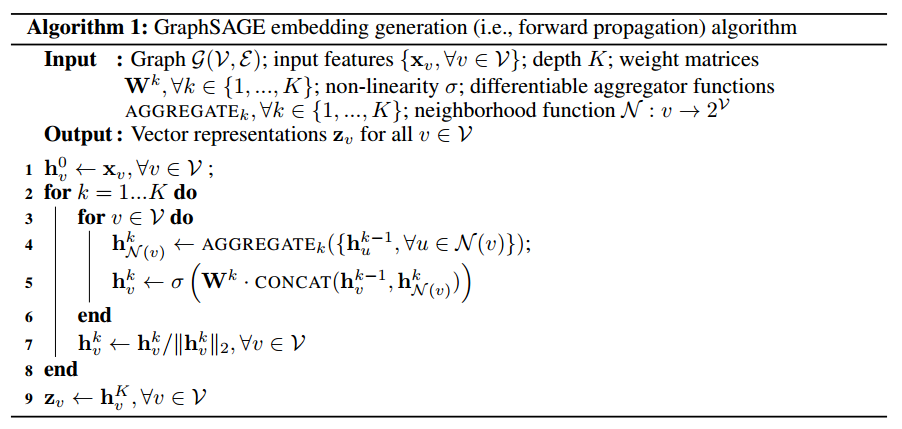
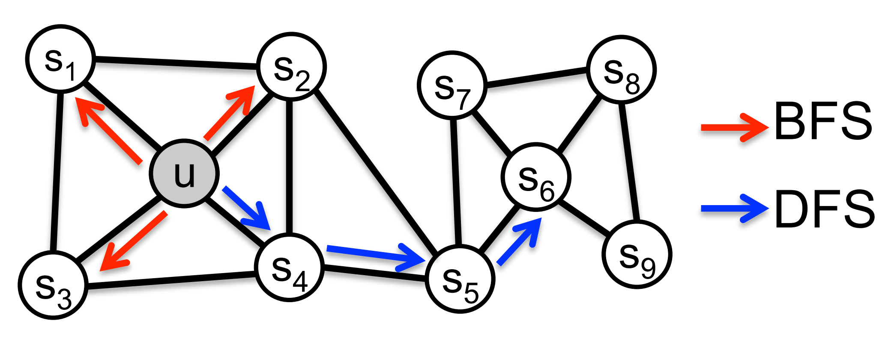
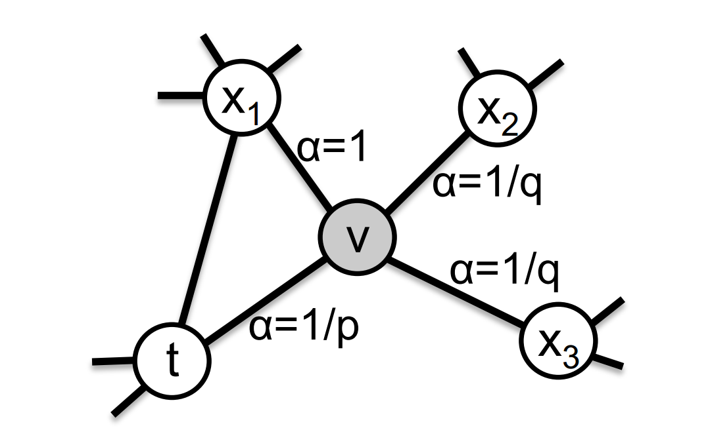

## index

- [2018 KDD PinSAGE]
- [2017 NIPS ]
- [2016 KDD node2vec](## 2016 KDD node2vec)
- [2014-deep walk]

## 2018 KDD PinSAGE

## 2017 NIPS GraphSAGE

**transductive learning vs inductive learning**

- transductive learning: 直推学习，只能对出现的节点生成表示向量
- inductive learning: 归纳学习，能通过连接馆学学习未见过节点的表示信息

**graphsage method**

根据连接关系生成当前节点的表示信息。

- Weisfeiler-Lehman Isomorphism Test: The GraphSAGE algorithm is conceptually
inspired by a classic algorithm for testing graph isomorphism
- aggregator architecture
    - mean aggregator: 
    
    $$\mathbf{h}_{v}^{k} \leftarrow \sigma\left(\mathbf{W} \cdot \operatorname{MEAN}\left(\left\{\mathbf{h}_{v}^{k-1}\right\} \cup\left\{\mathbf{h}_{u}^{k-1}, \forall u \in \mathcal{N}(v)\right\}\right)\right.$$

    - LSTM aggregator
    - pooling aggregator:

    $$\text { AGGREGATE }_{k}^{\mathrm{pool}}=\max \left(\left\{\sigma\left(\mathbf{W}_{\mathrm{pool}} \mathbf{h}_{u_{i}}^{k}+\mathbf{b}\right), \forall u_{i} \in \mathcal{N}(v)\right\}\right)$$

## 2016 KDD node2vec

- [offcial site](https://snap.stanford.edu/node2vec/)

**优化目标**：最大化当前节点的隐向量预测周围节点的概率

$$\max _{f} \sum_{u \in V} \log \operatorname{Pr}\left(N_{S}(u) \mid f(u)\right)$$

根据条件独立假设(Conditional independence)： 在给定当前节点下，临近点的概率与其余顶点无关

$$\operatorname{Pr}\left(N_{S}(u) \mid f(u)\right)=\prod_{n_{i} \in N_{S}(u)} \operatorname{Pr}\left(n_{i} \mid f(u)\right)$$

特征空间对称假设(Symmetry in feature space): 一个节点作为源节点与作为邻近节点时的隐向量是一致的

$$\operatorname{Pr}\left(n_{i} \mid f(u)\right)=\frac{\exp \left(f\left(n_{i}\right) \cdot f(u)\right)}{\sum_{v \in V} \exp (f(v) \cdot f(u))}$$

最终优化目标转化为：

$$\max _{f} \sum_{u \in V}\left[-\log Z_{u}+\sum_{n_{i} \in N_{S}(u)} f\left(n_{i}\right) \cdot f(u)\right]$$

其中$Z_{u}=\sum_{v \in V} \exp (f(u) \cdot f(v))$, 但在实际应用中采用负采样以降低$Z_{u}$的计算复杂度。

**经典搜索策略**

- BFS: 广度优先搜索
    - homophilic equivalence(同质等价): 相连接的节点在隐向量空间更为接近
- DFS: 深度优先搜索
    - structural equivalence(结构等价): 

**有偏随机游走(biased random walk)**

针对当前节点$v$访问下一节点$x$的概率为:

$$P\left(c_{i}=x \mid c_{i-1}=v\right)=\left\{\begin{array}{ll}
\frac{\pi_{v x}}{Z} & \text { if }(v, x) \in E \\
0 & \text { otherwise }
\end{array}\right.$$

其中:

$$\begin{aligned} Z:& \text{是正则化常数}   \\
                \pi_{vx}:& \text{未正正则化的概率} \\
                w_{vx}:& \text{边的权值} \\
                \pi_{v x}=&\alpha_{p q}(t, x) \cdot w_{v x} \\
                \alpha_{pq}:& \text{通过参数$p,q$参数控制的偏差函数} \\
                d_{tx}:& \text{下一个节点到上一个节点的边距}\\  
                \alpha_{p q}(t, x)=&\left\{\begin{array}{ll}
                            \frac{1}{p} & \text { if } d_{t x}=0 \\
                            1 & \text { if } d_{t x}=1 \\
                            \frac{1}{q} & \text { if } d_{t x}=2
                            \end{array}\right. \end{aligned}$$
- $d_{tx}$: 
    - 0代表下一个节点为$t$,即当前节点的上一个节点，即还原
    - 1代表该点与$t,v$相距皆为1,即$v,x$都环绕在节点$t$周围，类似BFS搜索
    - 2代表远离节点$t$，即类似DFS搜索
- return parameter, p: 表示下一个节点与上一个节点相同的概率
- in-out parameter, q: 控制游走向外还是向内。 若$q>1$, 则倾向于访问与上一个节点更近的节点，偏向BFS;反之则偏向DFS。

## 2015 LINE

- [arxiv, LINE: Large-scale Information Network Embedding](https://arxiv.org/abs/1503.03578)
- [code](https://github.com/tangjianpku/LINE)

## 2014 Deep Walk

random walks：

two stages:

- random walk generator
    - 通过随机游走产生$k$个长度为$l$的节点序列作为候选节点集合
    - 根据假设"Adjacent nodes are similar and should have similar embeddings",每一个节点序列应该有相近的向量表达
    - 方便并行化
- skipgram algorithm
    - 对于给定的语料，skipgram假设在一定大小窗口内的词应该有更相近的向量表达，这一窗口也叫做上下文
    - 对应到deepwalk，在第一步生成的节点序列可以认为是一个上下文窗口，因此可以用同样的方法来训练，即用当前节点预测上下文窗口内的节点
- optimization
    - Hierarchical Softmax
    - Parallelizability with asynchronous version of stochastic gradient descent (ASGD)
- variants
    - srtreaming
    - non-random walks

## ref 

- blog
- personal code
- paper
- project
