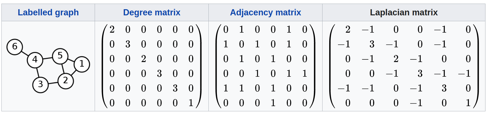

令$H^{(l)}$表示节点$l$的表示信息，则从直观上来看，图卷积就是类似下面函数的迭代式:

$$f\left(H^{(l)}, A\right)=\sigma\left(\hat{D}^{-\frac{1}{2}} \hat{A} \hat{D}^{-\frac{1}{2}} H^{(l)} W^{(l)}\right)$$

其中$A,D$表示节点的连接信息，$W$是需要学习的参数。这当然不符合对卷积的直观印象。而从更加广泛的角度来看，离散卷积就是加权求和。在接下来的笔记中，将从数学的联系上探讨为何图卷积是这样的形式以及这样的形式到底表示了含义。

## 拉普拉斯算子

- 梯度: 

$$\nabla F=(\frac{\partial F_{x}}{\partial x}, \frac{\partial F_{y}}{\partial y},\frac{\partial F_{z}}{\partial z})$$

- 散度(divergence): 

$$\operatorname{div} \mathbf{F}=\nabla \cdot \mathbf{F}=\frac{\partial F_{x}}{\partial x}+\frac{\partial F_{y}}{\partial y}+\frac{\partial F_{z}}{\partial z} $$

- 拉普拉斯算子(Laplace Operator): n维欧几里德空间中的一个二阶微分算子,定义为梯度($\nabla $)的散度（($\nabla \cdot f$)

$$\Delta F=\nabla\cdot (\nabla F)= \frac{\partial^{2} f}{\partial x^{2}}+\frac{\partial^{2} f}{\partial y^{2}}+\frac{\partial^{2} f}{\partial z^{2}}$$

**拉普拉斯矩阵**

$$L=D-A$$

- 拉普拉斯矩阵 $L$
- 度矩阵 $D$
- 邻接矩阵 $A$

$$\begin{aligned}\Delta h &=L\cdot H \\
&=\begin{bmatrix}\sum_{H^{(k)}\in nei(H^{(1)})} (H^{(1)}-H^{(k)}) \\ \sum_{H^{(k)}\in nei(H^{(2)})} (H^{(2)}-H^{(k)})\\ ... \end{bmatrix} \end{aligned}$$

如果如上式展开矩阵，则可以发现该矩阵表示了当前状态与各个邻接点之间的差值。这一差值可以标记为状态更新时的增量。则这一增量表达式表示**状态之间的传递强度正比于状态的差异**，这种情况类似于物理中的热传导，也在一定程度上表示了图状态的传递本质([Johnny Richards-如何理解 Graph Convolutional Network（GCN）？](https://www.zhihu.com/question/54504471))。矩阵中把邻接点的信息纳入进来进行计算，这在GraphSage的aggregator函数中也有体现。

常用的拉普拉斯矩阵有三种：

- Combinatorial Laplacian: $L=D-A$
- Symmetric normalized Laplacian: $L^{sys}=D^{-1/2}LD^{-1/2}$, 这事GCN常用的公式
- Random walk normalized Laplacian: $L^{rw}=D^{-1}L$, refer to [Diffusion-Convolutional Neural Networks]()

**拉普拉斯矩阵的特征分解(谱分解)**

拉普拉斯矩阵是半正定对称矩阵，具有如下性质：

- 实对称矩阵一定n个线性无关的特征向量
- 半正定矩阵的特征值一定非负
- 实对阵矩阵的特征向量总是可以化成两两相互正交的正交矩阵

特征分解： 

$$L=U\left(\begin{array}{lll}
\lambda_{1} \\
& \ddots \\
& & \lambda_{n}
\end{array}\right) U^{-1}$$

其中$\lambda_i$为特征值，$U$为正交矩阵，$UU^t=E$

**特征向量和基函数**

欧式空间中连续函数的拉普拉斯算子可以对应到图结构离散空间的拉普拉斯矩阵，两者都可以描述**状态之间的传递强度正比于状态的差异**，这样对函数进行的运算转化为对图结构的矩阵运算。

矩阵中特征向量满足特征方程: $AV=\lambda V$. 对于算子也可有自己的特征函数，对于拉普拉斯算子，由于$\Delta e^{-i\omega t} =\frac{\partial^{2}}{\partial t^{2}} e^{-i \omega t}=-\omega^{2} e^{-i \omega t} $, 所以$e^{-iwt}$是拉普拉斯算子的特征函数。这样可以把拉普拉斯算子的特征函数和拉普拉斯矩阵的特征向量对应起来。

## 傅里叶变换

传统的傅里叶变换为:

$$F(\omega)=\mathcal{F}[f(t)]=\int f(t) e^{-i \omega t} d t$$

傅里叶变换的实质是将函数以基函数$e^{-i \omega t}$来表示，其中变换的结果表示这些基函数的分量值。由于$e^{-i \omega t}$可以表示乘三角函数的形式，所以傅里叶变换将函数以三角函数为基进行展开，变换结果可以认为是频率的强度。事实上，针对任意一组正交基函数，都可以进行类似的变化，只不过以三角函数为基函数的被命名为傅里叶变换。

$f$ 是Graph上的 $N$ 维向量, $f(i)$ 与Graph的顶点一一对应, $u_{l}(i)$ 表示第 $l$ 个特征向量的第 $i$ 个分量。那么特征值（频率） $\lambda_{l}$ 下的， $f$ 的Graph 傅里叶变换就是与 $\lambda_{l}$ 对应的特征向量 $u_{l}$ 进 行内积运算。

把基函数对应到基向量，即特征向量，并把傅里叶变换推广到图结构中，则$f$在图上的傅里叶变换为:

$$\left(\begin{array}{c}
\hat{f}\left(\lambda_{1}\right) \\
\hat{f}\left(\lambda_{2}\right) \\
\vdots \\
\hat{f}\left(\lambda_{N}\right)
\end{array}\right)=\left(\begin{array}{cccc}
u_{1}(1) & u_{1}(2) & \ldots & u_{1}(N) \\
u_{2}(1) & u_{2}(2) & \ldots & u_{2}(N) \\
\vdots & \vdots & \ddots & \vdots \\
u_{N}(1) & u_{N}(2) & \ldots & u_{N}(N)
\end{array}\right)\left(\begin{array}{c}
f(1) \\
f(2) \\
\vdots \\
f(N)
\end{array}\right)  \\
\hat{f}=U^Tf$$

传统的傅里叶逆变换为对频率$\omega$，即特征值，求积分:

$$\mathcal{F}^{-1}[F(\omega)]=\frac{1}{2 \Pi} \int F(\omega) e^{i \omega t} d \omega$$

图结构上的逆变换为**对特征值求和**:

$$\left(\begin{array}{c}
f(1) \\
f(2) \\
\vdots \\
f(N)
\end{array}\right)=\left(\begin{array}{cccc}
u_{1}(1) & u_{2}(1) & \ldots & u_{N}(1) \\
u_{1}(2) & u_{2}(2) & \ldots & u_{N}(2) \\
\vdots & \vdots & \ddots & \vdots \\
u_{1}(N) & u_{2}(N) & \ldots & u_{N}(N)
\end{array}\right)\left(\begin{array}{c}
\hat{f}\left(\lambda_{1}\right) \\
\hat{f}\left(\lambda_{2}\right) \\
\vdots \\
\hat{f}\left(\lambda_{N}\right)
\end{array}\right)  \\
f=U\hat{f}$$

## 卷积

卷积定理：函数卷积的傅里叶变换是函数傅里叶变换的卷积，即函数卷积是函数傅里叶变换乘积的逆变换:

$$f * h=\mathcal{F}^{-1}[\hat{f}(\omega) \hat{h}(\omega)]=\frac{1}{2 \Pi} \int \hat{f}(\omega) \hat{h}(\omega) e^{i \omega t} d \omega$$

类比到图结构，设$h$为卷积核，则尝试根据傅里叶变换$\hat{f},\hat{h}$求得$f,h$的卷积。事实上我们不需要关心$h$是什么。只需要设计出$h$傅里叶变换之后的$\hat{h}$作为卷积核进行变换即可。

这里假设$\hat{h}$为对角阵:

$$\left(\begin{array}{llll}
\hat{h}\left(\lambda_{1}\right) & & \\
& \ddots & \\
& & \hat{h}\left(\lambda_{n}\right)
\end{array}\right)$$

则有:

$$\begin{aligned}(f*g)&=\mathcal{F}^{-1}[\hat{h}\cdot \hat{f}]  \\
&=\mathcal{F}^{-1}[\hat{h} \cdot U^TF ] \\ 
&=U\cdot \hat{h} \cdot U^TF    \\
&=U\left(\left(U^{T} h\right) \odot\left(U^{T} f\right)\right) \end{aligned}\\
\odot: \text{Hadamard product, element-wise production}$$

## ref 

- blog
    - [gcn author - GRAPH CONVOLUTIONAL NETWORKS](http://tkipf.github.io/graph-convolutional-networks/)
- personal code
- paper
    - [2017 ICLR SEMI-SUPERVISED CLASSIFICATION WITH
GRAPH CONVOLUTIONAL NETWORKS]()
- project
