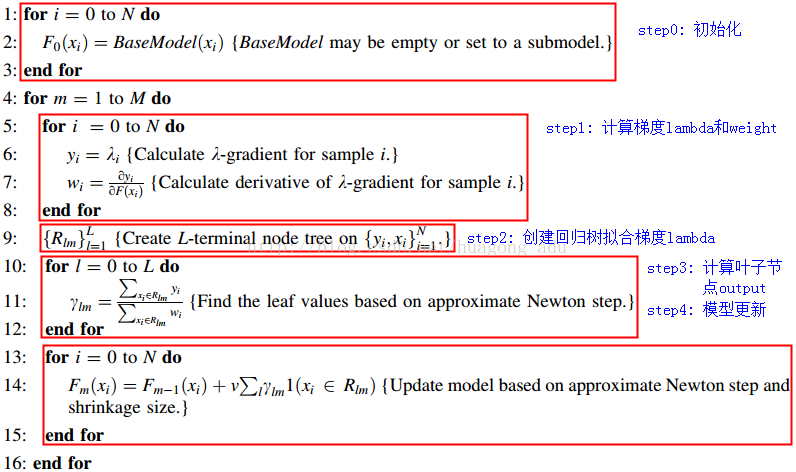

## RankNet

模型就是一个函数，把特征映射为一个得分：$\hat{y}=f(x)$. 而在排序任务上，各个排序模型的设计要点是怎么把模型得分与排序关联到一起来构造损失函数。

RankNet通过比较两个文档对($U_i,U_j$)之间的得分，并通过sigmoid函数把得分映射到[0,1]来表示哪个文档更应该排在前面。并把这一关系式称为$U_i$比$U_j$更相关的概率预测值, 其中$s_i,s_j$为模型的预测得分：

$$P_{i j}=P\left(U_{i}>U_{j}\right)=\frac{1}{1+e^{-\sigma\left(s_{i}-s j\right)}}$$

真实的相关性概率定义为: 

$$\begin{align}
\bar{p}_{i j}=& \frac{1}{2}\left(1+S_{i j}\right) \\
0: & S_{i j}=-1, \quad \text{$U_i$比$U_j$更不相关}    \\
1: & S_{i j}=1, \quad \text{$U_i$比$U_j$更相关}    \\
0.5:& S_{i j}=0, \quad \text{$U_i$与$U_j$同等相关}    
\end{align}$$

这样就可以利用交叉熵衡量预测概率与实际概率的差异：

$$C=-\bar{P}_{i j} \log P_{i j}-\left(1-\bar{P}_{i j}\right) \log \left(1-P_{i j}\right)    \\
\begin{aligned}
&\begin{aligned}
C_{i j} &=-\frac{1}{2}\left(1+S_{i j}\right) \log \frac{1}{1+e^{-\sigma\left(s_{i}-s_{j}\right)}}-\frac{1}{2}\left(1-S_{i j}\right) \log \frac{e^{-\sigma\left(s_{i}-s_{j}\right)}}{1+e^{-\sigma\left(s_{i}-s j\right)}} \\
&=-\frac{1}{2}\left(1+S_{i j}\right) \log \frac{1}{1+e^{-\sigma\left(s_{i}-s_{j}\right)}}-\frac{1}{2}\left(1-S_{i j}\right)\left[-\sigma\left(s_{i}-s_{j}\right)+\log \frac{1}{1+e^{-\sigma\left(s_{i}-s j\right)}}\right] \\
&=\frac{1}{2}\left(1-S_{i j}\right) \sigma\left(s_{i}-s_{j}\right)+\log \left(1+e^{-\sigma\left(s_{i}-s j\right)}\right)
\end{aligned}\\
&\text { 当Sij=1，有： }\\
&C=\log \left(1+e^{-\sigma\left(s_{i}-s_{j}\right)}\right)\\
&\begin{array}{l}
\text { 当Sij=-1，有： } \\
C=\log \left(1+e^{-\sigma\left(s_{j}-s_{i}\right)}\right)
\end{array}
\end{aligned}$$

损失函数的梯度：

$$\lambda_{i j} \equiv \frac{\partial C\left(s_{i}-s_{j}\right)}{\partial s_{i}}=\sigma\left(\frac{1}{2}\left(1-S_{i j}\right)-\frac{1}{1+e^{\sigma\left(s_{i}-s_{j}\right)}}\right)$$

这样可以通过两辆比较得出整个排序列表，这种方法也叫做pair-wise损失。

## LambdaRank

RankNet关注的是逆序对的减少，而没有对头部排序有偏向性。基于此LambdaRank在RankNet损失函数梯度的**基础上增加了对头部排序的偏向因子**。即把交换两个文档引起的$|\Delta NDCG|$的变化作为其中的一个因子。加入该因子的含义是，排序靠前的文档错位比排序靠后的文档错位更加重要。

$$\lambda_{i j}=\frac{\partial C\left(s_{i}-s_{j}\right)}{\partial s_{i}}=\frac{-\sigma}{1+e^{\sigma\left(s_{i}-s_{j}\right)}}\left|\Delta_{N D C G}\right| \\
\text{这里只考虑$S_{ij}=1$的情况，故省略}$$

这里的损失函数梯度考虑了整个文档序的情况，故也被称为是list-wise的方法。另外该定义是直接在梯度上增加因子，而没有考虑原损失函数的具体形式，这样就把离散的NDCG评价指标纳入了损失函数。

该梯度也被称为`lambda梯度`(只是因为以lambda标识？)。

## LambdaMart

LambdaMart把lambda梯度和树模型结合在一起，是最为流行的LTR方法。

lambda梯度的计算：对于当前排序下的文档$U_i$,计算关于文档$U_i$的所有文档对的lambda梯度：

$$\frac{\partial C}{\partial s_{i}}=\sum_{j:\{i, j\} \in I} \frac{-\sigma\left|\Delta_{Z_{i j}}\right|}{1+e^{\sigma\left(s_{i}-s_{j}\right)}}=\sum_{j:\{i, j\} \in I}-\sigma\left|\Delta_{Z_{i j}}\right| \rho_{i j}$$

再计算二次梯度导数：

$$\frac{\partial^{2} C}{\partial s_{i}^{2}}=\sum_{\{i, j\} \rightleftharpoons I} \sigma^{2}\left|\Delta_{Z_{i j}}\right| \rho_{i j}\left(1-\rho_{i j}\right)$$

计算第m棵树的第k个叶子节点上的值:

$$\gamma_{k m}=\frac{\sum_{x_{i} \in R_{k m}} \frac{\partial C}{\partial s_{i}}}{\sum_{x_{i} \in R_{k m}} \frac{\partial^{2} C}{\partial s_{i}^{2}}}=\frac{-\sum_{x_{i} \in R_{k m}} \sum_{\{i, j\} \rightleftharpoons I}\left|\Delta_{Z_{i j}}\right| \rho_{i j}}{\sum_{x_{i} \in R_{k m}} \sum_{\{i, j\} \rightleftharpoons I}\left|\Delta_{Z_{i j}}\right| \sigma \rho_{i j}\left(1-\rho_{i j}\right)}$$

根据下图的步骤，由于这里使用的损失函数交叉熵，并没有直接使用负梯度进行优化，而是采用通用的用近似值代替的方法。事实上在xgboost损失函数中通过二阶泰勒展开，就可以得到没有正则项的同样的公式。

从广义上讲，lambda损失只是一种损失函数的形式，而得分$s_i$可以采用任何一种机器学习/深度学习的方法来做。因此可以说对于排序任务，如何定义损失函数是其精髓所在;另一方面，在ltr领域，把深度学习纳入进得分函数，便可以通过损失函数的设计，通过深度学习来处理排序任务。

## ref

- [排序学习(LTR)杂谈 (下)](https://zhuanlan.zhihu.com/p/138436960)

$$f=\frac{1}{1+e^x}\\
1-f=\frac{e^x}{1+e^x}=\frac{1}{1+e^{-x}} \\
\partial f=\frac{-e^x}{(1+e^x)^2}=-f(1-f)
$$