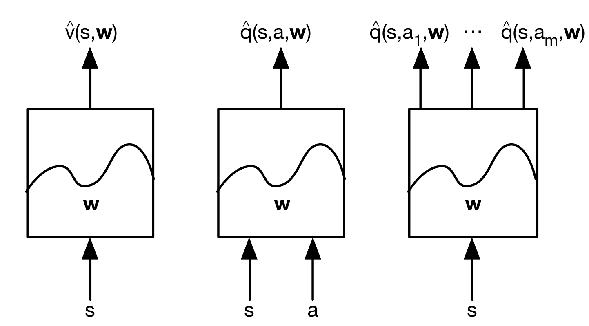

Estimate value function with function approximation:
$$\begin{align}\hat v(s,w)&\approx v_\pi(s)\\
\hat q(s,a,w)&\approx  q_\pi(s,a)\end{align}$$

three kinds input<--->output types:

Some differentiable function approximators:
- linear combinations of features
- neural network
- decision tree
- nearest neighbour
- fourier/wavelet bases
- ...

**optimal object**: find parameter vector $w$ to minimise mena-squared error between approximate value function$ \hat v(s,w)$ and true value function $v_\pi(s)$.
$$J(w)=E[(v_\pi(s)-\hat v(s,w))^2]$$

**gradient descent**:
$$\begin{align}\Delta w&=\frac{1}{2}\alpha\Delta_wJ(w)\\
&=\alpha(v_\pi(s)-\hat v(s,w))\Delta_w\hat v(s,w)\end{align}$$

**feature vector**
$$x(s)=\begin{bmatrix}x_1(s)\\\vdots \\x_n(s)\end{bmatrix}$$