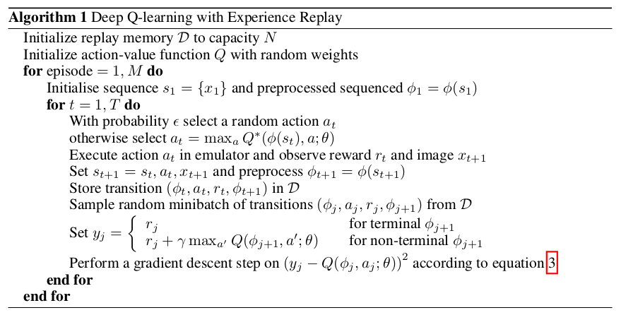
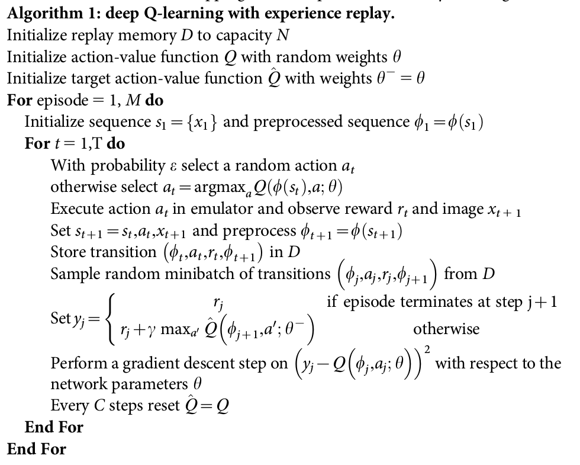

manily demonstrated in DQN

**paper**
- [DQN NIPS 2013](https://arxiv.org/pdf/1312.5602.pdf)
- [DQN NIPS 2015](http://web.stanford.edu/class/psych209/Readings/MnihEtAlHassibis15NatureControlDeepRL.pdf)
- [DDQN](https://link.zhihu.com/?target=http%3A//www.aaai.org/ocs/index.php/AAAI/AAAI16/paper/download/12389/11847)
- [Prioritized Replay DQN](https://arxiv.org/pdf/1511.05952.pdf)
- [Dueling DQN](https://arxiv.org/pdf/1511.06581.pdf)

## DQN

对于连续或者复杂的状态集合，用离散的Q表来存储显得不太现实。故考虑用神经网络拟合出Q(S,A).

神经网络的参数更新依赖于损失函数，损失函数定义为当前Q值与预测Q之间的误差。当网络参数收敛时，当前和预测值之间误差为0.

experience replay: to alleviate the problems of correlated data and non-stationary distributitions

loss function:
$$L_i(\theta_i)=E[(y_i-Q(s,a;\theta_i))^2] \\
y_i=E[r+\gamma\max_{a'}Q(s',a';\theta_{i-1})]$$

- model-free
- off-policy

## Nature DQN

在DQN(2013)中，目标Q值使用到了当前Q网络参数来计算，而后在放入经验池中后又根据此来更新网络参数，两者之间有较强的相关性。而在Nature dqn中，构建了两个Q网络，一个当前Q网络用来更新参数，另一个Q‘网络计算目标Q值。Q’网络中的参数每隔一定轮次便复制Q网络中的参数，即Q‘网络延时更新，以减少相关性。

经实验存在剧烈波动。

## DDQN

DDQN通过解耦目标Q值动作的选择和目标Q值的计算这两步，来达到消除过拟合的问题。在Nature DQN中目标Q值的计算是以贪婪法进行的:
$$y_j=R_j+\gamma\max_{a'}Q'(\phi(S_j'),A_j',w')$$
而在DDQN中，先在当前Q网络中找出最大Q值对应的动作，再根据动作计算目标Q值:
$$y_j=R_j+\gamma\max_{a'}Q'(\phi(S_j'),\arg \max_{a'}Q(\phi(S_j'),a,w),w')$$

## Prioritized Replay DQN

在之前的算法里，网络更新的样本是从经验回放池里随机采样的。但是对于反向传播，误差越大对参数更新的作用越大，故希望误差较大的能更容易被采到。

## Dueling DQN