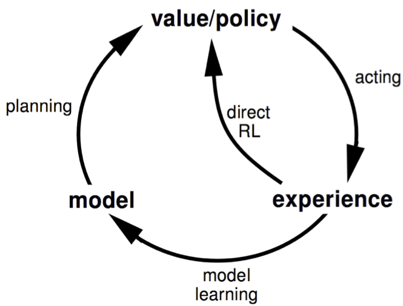
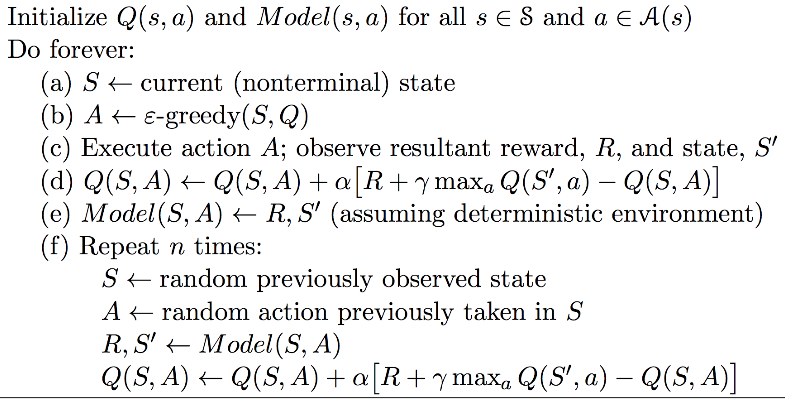
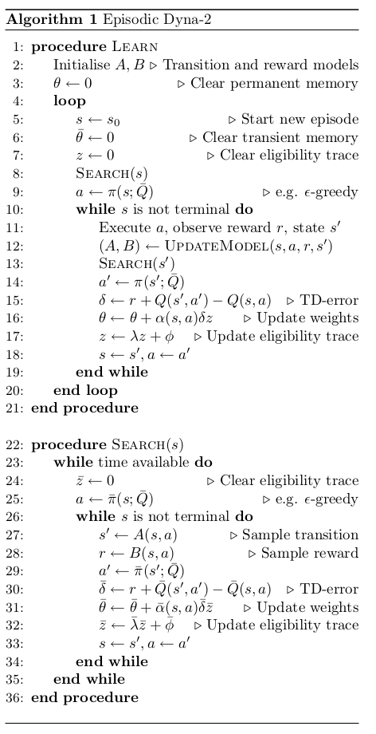

- learn a model from experience
- plan value function (and/or policy) from model

A model $M=<P_\eta,R_\eta>$ represents the state transitions $P_\eta=P$ and rewards $R_\eta=R$:
$$S_{t+1}\sim P_\eta(S_t+1|S_t,A_t) \\
R_{t+1}\sim R_\eta(R_t+1|S_t,A_t)$$
Typicallt assume conditional independence between state transitions and reward:
$$P(S_{t+1},R_{t+1}|S_t,A_t)=P(S_{t+1}|S_t,A_t)P(R_{t+1}|S_t,A_t)$$

**train process**

select some complete episodes to train then this becomes a supervised learning problem.

- learning $s,a\rightarrow r$ is a regression problem
- learning $s,a\rightarrow s'$ is a density estimation problem
- update $\eta$ to minimise loss function

**Dyna**

Integrating learning and planning.

Dyna-Q algorithm:

Dyna2 algorithm:

## simulation-based search

[alpha-go zero](https://link.jianshu.com/?t=https://www.nature.com/articles/nature24270.epdf?author_access_token=VJXbVjaSHxFoctQQ4p2k4tRgN0jAjWel9jnR3ZoTv0PVW4gB86EEpGqTRDtpIz-2rmo8-KG06gqVobU5NSCFeHILHcVFUeMsbvwS-lxjqQGg98faovwjxeTUgZAUMnRQ)