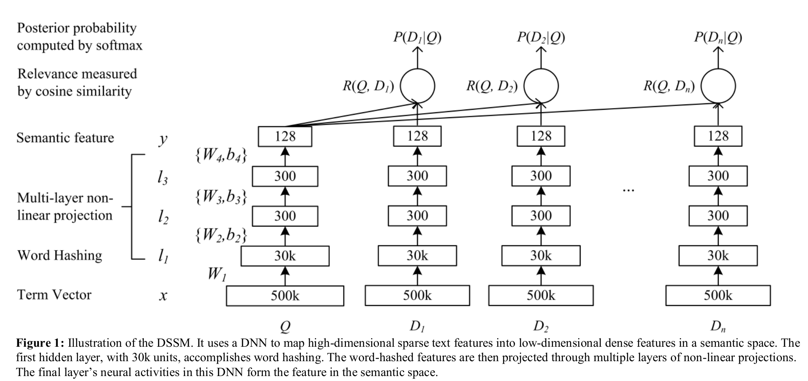
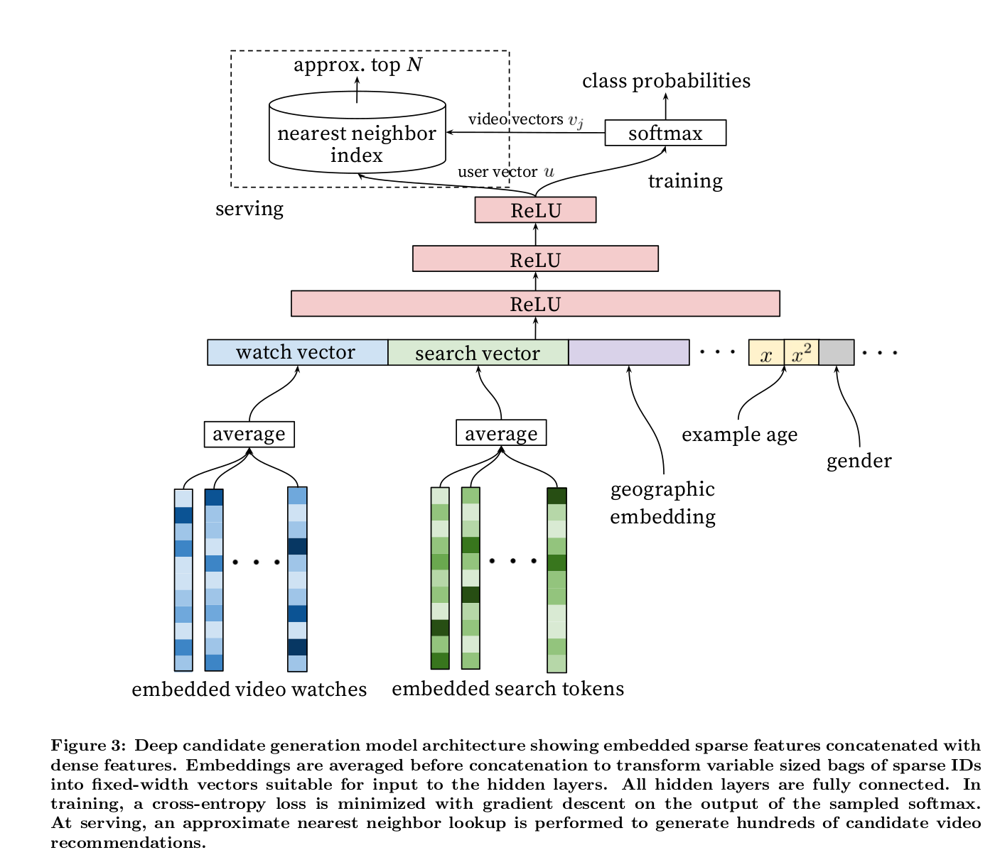
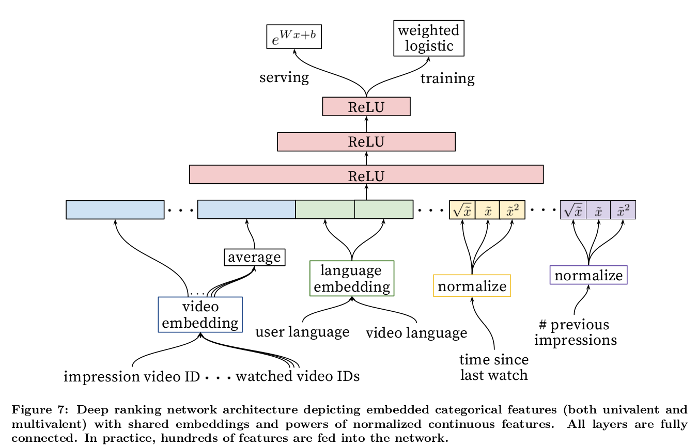
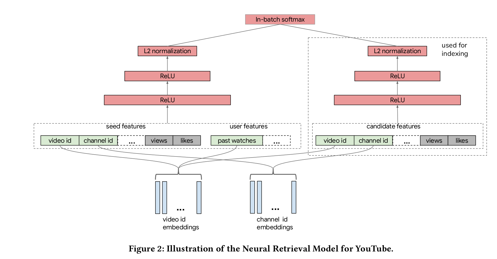

## 2013 dssm microsoft

网络结构： 

- input: query/doc 都统一转化为单词，再把单词转化为n-gram，两者网络结构相同，只是训练的权重不同
- 中间处理：
    - term vector: 500k, 单词树；bang，表示单词的one-hot编码
    - word hashing: 通过n-gram降维，good-> #good# -> #go, goo,ood,od#, 这样500k个单词变为30
    k个term
- 训练：
    - 内积; softmax 概率; tanh activation function
    $$P(D \mid Q)=\frac{\exp (\gamma R(Q, D))}{\sum_{D^{\prime} \in D} \exp \left(\gamma R\left(Q, D^{\prime}\right)\right)} \\
    L(\Lambda)=-\log \prod_{\left(Q, D^{+}\right)} P\left(D^{+} \mid Q\right)    $$
    - 通过所有的doc计算softmax，而只对正样本进行四然估计
        - 正样本$D^+$： 当前query被点击的doc
        - 负样本$D^-$： 当前query未被点击的doc，这里只随机取了4个来代替
        - 样本集合$D=D^+ \cupD^-$：这里用部分来代表整体 
- 总结：
    - 优点：
        - 解决字典爆炸
        - n-gram的泛化能力，更好的处理新词
        - 使用有监督的方法
    - 缺点：
        - wordhashing出现hash冲突
        - 词袋，损失了语序，后期变种CNN-DSSM， LSTM-DSSM
        - 曝光量会影响用户的点击，全部用点击作为政府样本容易出现噪声

## 2016 item2vec

- [Embedding在推荐算法中的应用总结](https://zhuanlan.zhihu.com/p/78144408)
- [DNN论文分享 - Item2vec](https://zhuanlan.zhihu.com/p/24339183?refer=deeplearning-surfing)

## 2016 youtube dnn

- 数据：
    - 特征选择： 把看过的视频作为用户的特征
    - 历史视频id，50个id+50次搜索， share embedding
    - example age, fresh
    - 特征丰富：$x,\sqrt(x),x^2$
- model：
    - candidate model: recall， 考虑根据内积进行最近邻搜索
    - ranking model: rank, 考虑更加丰富的特征
- train:
    - ann召回
    - softmax多分类
    - 负采样： 选取一部分样本来代表整体

## 2018 alibaba tdm

## 2019 youtube 

分别构建query和item端参数结构，通过内积进行embedding:

$$s(x, y)=\langle u(x, \theta), v(y, \theta)\rangle$$

treated as multi-class classification, $r_i$ is the reward:

$$\mathcal{P}(y \mid x ; \theta)=\frac{e^{s(x, y)}}{\sum_{j \in[M]} e^{s\left(x, y_{j}\right)}} \\
L_{T}(\theta):=-\frac{1}{T} \sum_{i \in[T]} r_{i} \cdot \log \left(\mathcal{P}\left(y_{i} \mid x_{i} ; \theta\right)\right) $$

负采样，选用部分来代表整体。从视频榴中选择的话，较热门的视频有更高的概率被作为负样本，所以引入log修正：

$$s^{c}\left(x_{i}, y_{j}\right)=s\left(x_{i}, y_{j}\right)-\log \left(p_{j}\right)$$

With the correction, we have

$$
\mathcal{P}_{B}^{c}\left(y_{i} \mid x_{i} ; \theta\right)=\frac{e^{s^{c}\left(x_{i}, y_{i}\right)}}{e^{s^{c}\left(x_{i}, y_{i}\right)+\sum_{j \in[B], j \neq i} e^{s^{c}\left(x_{i}, y_{j}\right)}}}
$$

the batch loss function

$$
L_{B}(\theta):=-\frac{1}{B} \sum_{i \in[B]} r_{i} \cdot \log \left(\mathcal{P}_{B}^{c}\left(y_{i} \mid x_{i} ; \theta\right)\right)
$$
Running SGD with learning rate $\gamma$ yields the model parameter update as

$$
\theta \leftarrow \theta-\gamma \cdot \nabla L_{B}(\theta)
$$

- perspectives of data
- model architecture: nomination/retrival/candidate  rank
- training
- serving

## 2019 facebook dlrm

- [github-dlrm](https://github.com/facebookresearch/dlrm)

## 离散特征工程

- labelEncoding: 离散特征编程数字
- OneHotEncoding
- HashEncoding
    - hash trick
    - hash 冲突
- embedding
    - 多值离散特征: 相加，平均
    - 多个特征： 拼接

## embedding

- ig2vec :instagram, instagrams explore recommender system
- [Recommender Systems: The Most Valuable Application of Machine Learning](https://towardsdatascience.com/recommender-systems-the-most-valuable-application-of-machine-learning-part-1-f96ecbc4b7f5)

## ref

1. blog
    - [实践DSSM召回模型](https://zhuanlan.zhihu.com/p/136253355)
    - [推荐系统中不得不说的DSSM双塔模型](https://zhuanlan.zhihu.com/p/139541282)
    - [DSSM|基于Transformer的语义相似度计算模型DSSM及代码开源](https://blog.csdn.net/qq_28385535/article/details/92803375)
    - [推荐召回算法之深度召回模型串讲](https://zhuanlan.zhihu.com/p/63343894)
2. paper
    - [2019-facebook-dlrm](Deep Learning Recommendation Model for Personalization and Recommendation Systems)
3. personal code
    - [dssm](https://github.com/InsaneLife/dssm)
    - [DSSM-Pytorch](https://github.com/ChrisCN97/DSSM-Pytorch)
    - [dssm](https://github.com/baharefatemi/DSSM)
    - [ant-learn-recsys](https://github.com/peiss/ant-learn-recsys/tree/08f8df7d158706716e9323424f8085d01b047366)
4. open project
    - [DeepCTR](https://github.com/shenweichen/DeepCTR)
    - [DeepMatch](https://github.com/shenweichen/DeepMatch)
    - [MatchZoo](https://github.com/NTMC-Community/MatchZoo)
    - [dlrm](https://github.com/facebookresearch/dlrm)

