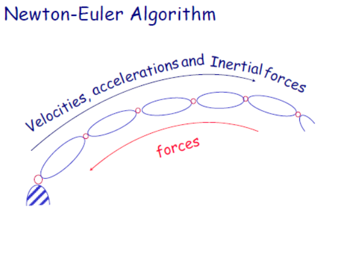

##acceleration

**线加速度**

动点在相对坐标系B中的运动，变换到坐标系A中的表达式：

$$^AV_Q=^AR_B{}^BV_Q+{}^AV_{BORG}+{}^A\Omega _B\times {}^AR_B{}^BQ$$
$$\begin{align}\frac{d({}^AV_{BORG})}{dt}&={}^A\dot{V}_{BORG} \\ \frac{d({}^AR_B{}^BV_Q)}{dt}&=^AR_B{}^B\dot{V}_Q+{}^A\Omega _B\times ^AR_B{}^BV_Q \\ \frac{d({}^A\Omega _B\times {}^AR_B{}^BQ)}{dt}&= {}^A\dot{\Omega} _B\times {}^AR_B{}^BQ+{}^A\Omega _B\times ({}^A\Omega _B\times {}^AR_B{}^BQ+{}^AR_B{}^BV_Q+{}^AV_{BORG}) \end{align}$$

其中叉积的性质：

$$\frac{d(a\times b)}{dt}=\frac{da}{dt}\times b+a\times \frac{db}{dt}$$

in revolute joint:

$$^A\dot{V}_Q={}^A\dot{\Omega} _B\times {}^AR_B{}^BQ+{}^A\Omega _B\times {}^A\Omega _B\times {}^AR_B{}^BQ$$

in prismatic joint:

$$^A\dot{V}_Q={}^A\dot{V}_{BORG}+{}^A\dot{\Omega} _B\times {}^AV_{BORG}$$

**角加速度**

$${}^A\Omega_C={}^A\Omega_B+{}^A_BR{}^B\Omega_C  \\ {}^A\dot{\Omega}_C={}^A\dot{\Omega}_B+{}^A_BR{}^B\dot{\Omega}_C+ {}^A\Omega_B\times {}^A_BR{}^B\Omega_C$$

## rigid body dynamics

**linear momentum**

$$\psi=mv \\ \frac{d\psi}{dt}=F$$

**angular momentum**(角动量/动量矩)

$$p\times m\dot{v}=p\times F=N$$(moments, 力矩)

$$\phi=p\times mv$$

刚体定轴转动：

$$\phi=\int_Vp\times(\omega\times p)\rho d\nu$$

$$p\times(\omega\times p)=p\times(-p)\times \omega=\hat{p}(-\hat{p})\omega$$

so: 

$$\phi=\int\hat{p}(-\hat{p})\rho d\nu\cdot\omega=I\omega$$ ($I$, **inertia tensor**)

**Newton equation and Euler equation**

$$\begin{align}\dot{\psi}&=F \\ F&=ma \\ \dot{\phi}&=N \\ N&=I\dot{\omega}+\omega\times I\omega \end{align}$$（此处请注意对角动量的求导，对惯性张量**I**的求导）

**inertia tensor**

$$\begin{align}I&=\int_V\hat{p}(-\hat{p})\rho d\nu \\&=\int_V((p^Tp)E_3-pp^T)\rho d\nu \end{align}$$

*parallel axis theorem*

$p_C$为坐标系C原点在坐标系A中的坐标。

$$I_A=I_C+M[(p_C^Tp_C)E_3-p_Cp_C^T]$$

##Newton-Euler algorithm

$$F_i=m\dot{v}_{c_1} \\ N_i={}^{C_i}I\dot{\omega}_i+\omega_i\times {}^{C_i}I\omega_i $$

where the origin of frame{$C_i$} is at the center of the body, with the same orientation as frame{i}.

由关节位置，速度和加速度计算所需的关节力矩。

forward equation: vel, acceleration

$$\begin{aligned}
&\boldsymbol{\omega}_{i}=\boldsymbol{\omega}_{i-1}+\mathbf{z}_{i} \dot{\theta}_{i} \\
&\dot{\boldsymbol{\omega}}_{i}=\dot{\boldsymbol{\omega}}_{i-1}+\mathbf{z}_{i} \ddot{\theta}_{i}+\boldsymbol{\omega}_{i-1} \times \mathbf{Z}_{i} \dot{\theta}_{i} \\
&\mathbf{a}_{i}=\mathbf{a}_{i-1}+\dot{\boldsymbol{\omega}}_{i-1} \times \mathbf{s}_{i-1}+\boldsymbol{\omega}_{i-1} \times\left(\boldsymbol{\omega}_{i-1} \times \mathbf{s}_{i-1}\right) \\
&\mathbf{a}_{C_{i}}=\mathbf{a}_{i}+\dot{\boldsymbol{\omega}}_{i} \times \mathbf{r}_{i-1}+\boldsymbol{\omega}_{i} \times\left(\boldsymbol{\omega}_{i} \times \mathbf{r}_{i-1}\right)
\end{aligned}$$

forward:

$$\begin{aligned}
&{ }^{i+1} \omega_{i+1}={ }_{i}^{i+1} R^{i} \omega_{i}+\dot{\theta}_{i+1}{ }^{i+1} Z_{i+1}\\
&{ }^{i+1} \dot{\omega}_{i+1}={ }_{i}^{i+1} R^{i} \dot{\omega}_{i}+_{i}^{i+1} R^{i} \omega_{i} \times (\dot{\boldsymbol{\theta}}_{i+1}{ }^{i+1} Z_{i+1})+\ddot{\theta}_{i+1}{ }^{i+1} Z_{i+1}\\
&{ }^{i+1} \dot{v}_{i+1}=_{i}^{i+1} R\left(^{i} \dot{\omega}_{i} \times^{i} P_{i+1}+^{i} \omega_{i} \times\left({ }^{i} \omega_{i} \times{ }^{i} P_{i+1}\right)+{ }^{i} \dot{v}_{i}\right)\\
&{ }^{i+1} \dot{v}_{c_{i+1}}={ }^{i+1} \dot{\omega}_{i+1} \times{ }^{i+1} P_{C_{i+1}}\\
&+{ }^{i+1} \omega_{i+1} \times\left({ }^{i+1} \omega_{i+1} \times ^{i+1} P_{c_{i+1}}\right)+{ }^{i+1} \dot{v}_{i+1}\\
&{ }^{i+1} F_{i+1}=m_{i+1}{ }^{i+1} \dot{v}_{C_{i+1}}\\
&{ }^{i+1} N_{i+1}={ }^{c_{i+1}} I_{i+1}{ }^{i+1} \dot{\omega}_{i+1}+{ }^{i+1} \omega_{i+1} \times{ }^{c_{i+1}} I_{i+1}{ }^{i+1} \omega_{i+1}\end{aligned}$$

backward

$$\begin{aligned}&{ }^{i} f_{i}={ }_{i+1}^{i} R^{i+1} f_{i+1}+{ }^{i} F_{i}\\
&n_{i}=^{i} N_{i}+{ }_{i+1}^{i} R^{i+1} n_{i+1}+{ }^{i} P_{C_{i}} \times{ }^{i} F_{i}\\
&+{ }^{i} P_{i+1} \times_{i+1}^{i} R^{i+1} f_{i+1}\\
&\tau_{i}={ }^{i} n_{i}^{T} \cdot {}^iZ_{i}
\end{aligned}$$

惯性张量：

$$\mathbf{I}=\left[\begin{array}{lll}
I_{x x} & I_{x y} & I_{x z} \\
I_{y x} & I_{y y} & I_{y z} \\
I_{z x} & I_{z y} & I_{z z}
\end{array}\right]$$

设 $w=[w_x, w_y, w_z]^T$,角动量：$L=Iw$

[two link arm ref](https://www.guyuehome.com/19198)

- inverse dynamics: q to torque
- forward dynamics: torque to q

$$\ddot{q} = M^{-1}(q)(\tau-C(q, \dot{q})\dot{q} -G(q))     \\
\dot{q} = \int \ddot{q}dt   \\
q = \int \dot{q}dt$$

## 动力学方程的结构

**state space equation**

$$\tau=M(q)\ddot{q}+V(q, \dot{q})+G(q)$$

$$\tau=M(q)\ddot{q}+V(q, \dot{q})+G(q) + J^T(\theta) F_{tip}$$

**configuration space equation**

$$\tau=M(q)\ddot{q}+B(q)[\dot{q}\dot{q}]+C(q)[\dot{q}^2]+G(q)$$

## Lagrange equation

$$L=K-U$$(kinetic energy-potential energy)

$$\frac{d}{dt}\frac{\partial L}{\partial \dot{q}}-\frac{\partial L}{\partial q}=\tau$$

$$\frac{d}{dt}\frac{\partial K}{\partial \dot{q}}-\frac{\partial K}{\partial q}+\frac{\partial U}{\partial q}=\tau$$

kinetic energy: $K=\sum_iK_i=\sum_i(\frac{1}{2}m_i\upsilon^T_{C_i}\upsilon_{C_i}+\frac{1}{2}{}^i\omega^T_i {}^{C_i}I_i\omega_i )=\frac{1}{2}\dot{q}^TM(q)\dot{q}$

$$\frac{\partial K}{\partial \dot{q}}=M(q)\dot{q} \\ \frac{d}{dt}\frac{\partial K}{\partial \dot{q}}=\frac{d}{dt}(M\dot{q})=M\ddot{q}+\dot{M}\dot{q}$$

$$\begin{align}\frac{d}{dt}\frac{\partial K}{\partial \dot{q}}-\frac{\partial K}{\partial q}&=M\ddot{q}+\dot{M}\dot{q}-\frac{1}{2}\begin{bmatrix}\dot{q}^T\frac{\partial M}{\partial q_1}\dot{q}\\ \vdots \\ \dot{q}^T\frac{\partial M}{\partial q_n}\dot{q}\end{bmatrix}\\ &=M\ddot{q}+V(q, \dot{q}) \end{align}$$

kinetic energy: work done by external forces to bring the system from rest to its current state.

## 

## two link arm

$$\begin{aligned}
&\boldsymbol{\tau}=\boldsymbol{M}(\boldsymbol{\theta}) \ddot{\boldsymbol{\theta}}+\boldsymbol{h}(\boldsymbol{\theta}, \dot{\boldsymbol{\theta}})+\boldsymbol{g}(\boldsymbol{\theta}) \\
&\boldsymbol{M}(\boldsymbol{\theta})=\left[\begin{array}{ll}
M_{11} & M_{12} \\
M_{21} & M_{22}
\end{array}\right] \quad \boldsymbol{h}(\boldsymbol{\theta}, \dot{\boldsymbol{\theta}})=\left[\begin{array}{c}
-m_{2} l_{1} l_{12} \dot{\theta}_{2}\left(2 \dot{\theta}_{1}+\dot{\theta}_{2}\right) \sin \theta_{2} \\
m_{2} l_{1} l_{g 2} \dot{\theta}_{1}^{2} \sin \theta_{2}
\end{array}\right] \\
&\boldsymbol{g}(\boldsymbol{\theta})=\left[\begin{array}{c}
m_{1} g l_{g 1} \cos \theta_{1}+m_{2} g\left(l_{1} \cos \theta_{1}+l_{g 2} \cos \left(\theta_{1}+\theta_{2}\right)\right) \\
m_{2} g l_{92} \cos \left(\theta_{1}+\theta_{2}\right)
\end{array}\right. \\
&M_{11}=I_{1}+I_{2}+m_{1} l_{g 1}^{2}+m_{2}\left(l_{1}^{2}+l_{g 2}^{2}+2 l_{1} l_{g 2}+2 l_{1} l_{g 2} \cos \theta_{2}\right) \\
&M_{12}=M_{21}=I_{2}+m_{2}\left(l_{g 2}^{2}+l_{1} l_{g 2} \cos \theta_{2}\right) \\
&M_{22}=I_{2}+m_{2} l_{g 2}^{2}
\end{aligned}$$

another version:

$$
\begin{aligned}
&\tau_{1}=H_{11} \ddot{\theta}_{1}+H_{12} \ddot{\theta}_{2}-h \dot{\theta}_{2}^{2}-2 h \dot{\theta}_{1} \dot{\theta}_{2}+G_{1} \\
&\tau_{2}=H_{22} \ddot{\theta}_{2}+H_{21} \ddot{\theta}_{1}+h \dot{\theta}_{1}^{2}+G_{2}
\end{aligned}
$$
where
$$
\begin{aligned}
&H_{11}=m_{1} \ell_{c 1}^{2}+I_{1}+m_{2}\left(\ell_{1}^{2}+\ell_{c 2}^{2}+2 \ell_{1} \ell_{c 2} \cos \theta_{2}\right)+I_{2} \\
&H_{22}=m_{2} \ell_{c 2}^{2}+I_{2} \\
&H_{12}=m_{2}\left(\ell_{c 2}^{2}+\ell_{1} \ell_{c 2} \cos \theta_{2}\right)+I_{2} \\
&h=m_{2} \ell_{1} \ell_{c 2} \sin \theta_{2} \\
&G_{1}=m_{1} \ell_{c 1} g \cos \theta_{1}+m_{2} g\left\{\ell_{c 2} \cos \left(\theta_{1}+\theta_{2}\right)+\ell_{1} \cos \theta_{1}\right\} \\
&G_{2}=m_{2} g \ell_{c 2} \cos \left(\theta_{1}+\theta_{2}\right)
\end{aligned}
$$

## ref

- [from urdf to kinematic and dynamic](https://github.com/mahaarbo/urdf2casadi/blob/master/urdf2casadi)

