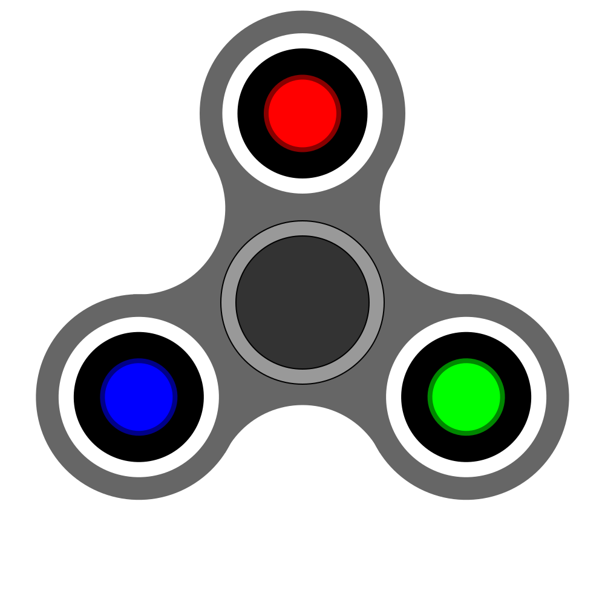
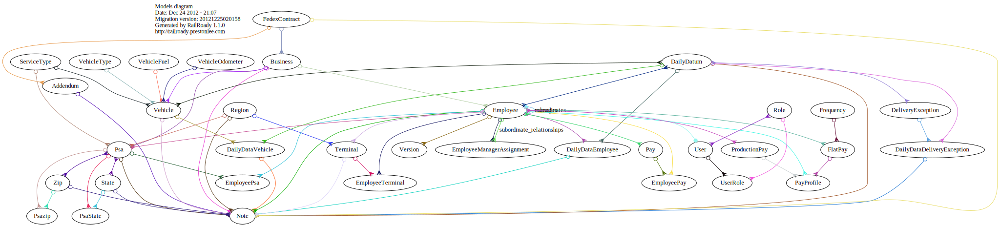

- [ ] hjsdf

## spin

  <h3>This is a header</h3>
  
This is a paragraph.

## js event

<svg width="600" height="600">
  
  <g>
    <text x="30" y="50" onMouseOver="showColor()">Click me to show rectangle color.</text>
    <rect id="rect1" x="100" y="100" width="200" height="200" 
    stroke="green" stroke-width="3" fill="red" 
    onClick="showArea(event)"/>
    <text x="30" y="400" onClick="showRootChildrenCount()">
    Click me to print child node count.</text>
  </g>
</svg>

## svg source  animation

<!-- <svg width="500px" height="500px" viewBox="0 0 500 500"> 
    <rect x="0" y="0" width="100" height="100" fill="#feac5e"> 
        <animate attributeName="x" from="0" to="500" dur="2s" repeatCount="indefinite" /> 
    </rect> 
</svg> -->

 HAHA

<svg width="300" height="400">
<circle cx="100" cy="50" r="10" stroke="black" stroke-width="2" opacity="0.5" fill="none" />
<circle cx="130" cy="50" r="10" stroke="black" stroke-width="2" opacity="0.5" fill="green" />
<rect x="200" y="50" width="80" height="80" style = "stroke:gray;stroke-width:2;opacity:0.5"/>
<polygon points="200,10 250,190 160,210"
  style="fill:lime;stroke:purple;stroke-width:1"/>
</svg>

<svg width="300" height="1000">
   <g>
      <text x="0" y="15" fill="black" >折线 #1: 不透明.</text>
      <polyline points="150,75 258,137.5 258,262.5 150,325 42,262.6 42,137.5"
      stroke="black" stroke-width="3" fill="none"> 
   </g> 
   <g>
      <text x="0" y="360" fill="black" >折线 #2: 透明 </text>
      <polyline points="150,375 258,437.5 258,562.5 150,625 42,562.6 42,437.5"
      style="fill:none;stroke-width:3;stroke:rgb(0,0,0);stroke-opacity:0.5;"> 
   </g>
   <g>
   <text x="0" y="720" fill="green"> tri</text>
   <polyline points="150,700, 300, 875, 0, 875, 150, 700"
      style="fill:green;stroke-width:3;stroke:none;opacity:0.5;stroke-opacity:0.1;">
   </g>
</svg>

## svg bar plot

<svg viewBox="0 0 200 100" id="chart">
  <g transform="translate(0, 100) scale(1, -1)" id="path-container">
    <path fill="none" stroke-width="3" stroke-linecap="round" stroke-linejoin="round" id="line" />
  </g>
  <text text-anchor="middle" alignment-baseline="middle" x="100" y="50" class="loading">
    Loading...
  </text>
</svg>

<svg   id="chart"   width="1000"   height="500"   viewBox="0 0 1000 500"   xmlns="http://www.w3.org/2000/svg" >      <path d="M 0,494.6161557159546 C 10.600000000000001,490.90278624297963 31.8,484.70445247876756 53,476.04930835107956 C 74.2,467.39416422339156 84.8,458.440377335893 106,451.3404350775147 C 127.2,444.2404928191365 137.8,443.39435171922645 159,440.5495970591883 C 180.2,437.7048423991501 190.8,450.95985144227745 212,437.1166617773237 C 233.2,423.27347211237 243.8,378.4583819606125 265,371.3336487344196 C 286.2,364.20891550822677 296.8,395.4580263379203 318,401.4929956463594 C 339.2,407.52796495479856 349.8,422.01850671741033 371,401.5084952766153 C 392.2,380.99848383582025 402.8,321.9917939372332 424,298.94293844238433 C 445.2,275.8940829475355 455.8,293.1174963898983 477,286.26421780237115 C 498.2,279.410939214844 508.8,269.33833812725834 530,264.67654550474856 C 551.2,260.0147528822388 561.8,249.29571895839766 583,262.95525468982237 C 604.2,276.6147904212471 614.8,329.5859313552686 636,332.97422416187214 C 657.2,336.3625169684757 667.8,309.6919671833167 689,279.89671872284 C 710.2,250.10147026236325 720.8,180.83820854956025 742,183.99798185948845 C 763.2,187.15775516941665 773.8,288.8689494646838 795,295.695585272481 C 816.2,302.52222108027826 826.8,248.45890726687986 848,218.1311608984746 C 869.2,187.80341453006935 879.8,159.6093064309536 901,144.0568534304548 C 922.2,128.50440042995598 932.8,154.56724058768506 954,140.36889589598047 C 975.2,126.1705512042759 996.4,86.52588315674163 1007,73.06512997193192,L 1000 500,L 0 500Z" fill="#444cf71a" />   <path d="M 0,494.6161557159546 C 10.600000000000001,490.90278624297963 31.8,484.70445247876756 53,476.04930835107956 C 74.2,467.39416422339156 84.8,458.440377335893 106,451.3404350775147 C 127.2,444.2404928191365 137.8,443.39435171922645 159,440.5495970591883 C 180.2,437.7048423991501 190.8,450.95985144227745 212,437.1166617773237 C 233.2,423.27347211237 243.8,378.4583819606125 265,371.3336487344196 C 286.2,364.20891550822677 296.8,395.4580263379203 318,401.4929956463594 C 339.2,407.52796495479856 349.8,422.01850671741033 371,401.5084952766153 C 392.2,380.99848383582025 402.8,321.9917939372332 424,298.94293844238433 C 445.2,275.8940829475355 455.8,293.1174963898983 477,286.26421780237115 C 498.2,279.410939214844 508.8,269.33833812725834 530,264.67654550474856 C 551.2,260.0147528822388 561.8,249.29571895839766 583,262.95525468982237 C 604.2,276.6147904212471 614.8,329.5859313552686 636,332.97422416187214 C 657.2,336.3625169684757 667.8,309.6919671833167 689,279.89671872284 C 710.2,250.10147026236325 720.8,180.83820854956025 742,183.99798185948845 C 763.2,187.15775516941665 773.8,288.8689494646838 795,295.695585272481 C 816.2,302.52222108027826 826.8,248.45890726687986 848,218.1311608984746 C 869.2,187.80341453006935 879.8,159.6093064309536 901,144.0568534304548 C 922.2,128.50440042995598 932.8,154.56724058768506 954,140.36889589598047 C 975.2,126.1705512042759 996.4,86.52588315674163 1007,73.06512997193192" fill="none" stroke="#444cf7" stroke-width="4px" />   <g>   		<circle cx="0" cy="494.6161557159546" r="8" fill="#444cf7" />,		<circle cx="53" cy="476.04930835107956" r="8" fill="#444cf7" />,		<circle cx="106" cy="451.3404350775147" r="8" fill="#444cf7" />,		<circle cx="159" cy="440.5495970591883" r="8" fill="#444cf7" />,		<circle cx="212" cy="437.1166617773237" r="8" fill="#444cf7" />,		<circle cx="265" cy="371.3336487344196" r="8" fill="#444cf7" />,		<circle cx="318" cy="401.4929956463594" r="8" fill="#444cf7" />,		<circle cx="371" cy="401.5084952766153" r="8" fill="#444cf7" />,		<circle cx="424" cy="298.94293844238433" r="8" fill="#444cf7" />,		<circle cx="477" cy="286.26421780237115" r="8" fill="#444cf7" />,		<circle cx="530" cy="264.67654550474856" r="8" fill="#444cf7" />,		<circle cx="583" cy="262.95525468982237" r="8" fill="#444cf7" />,		<circle cx="636" cy="332.97422416187214" r="8" fill="#444cf7" />,		<circle cx="689" cy="279.89671872284" r="8" fill="#444cf7" />,		<circle cx="742" cy="183.99798185948845" r="8" fill="#444cf7" />,		<circle cx="795" cy="295.695585272481" r="8" fill="#444cf7" />,		<circle cx="848" cy="218.1311608984746" r="8" fill="#444cf7" />,		<circle cx="901" cy="144.0568534304548" r="8" fill="#444cf7" />,		<circle cx="954" cy="140.36889589598047" r="8" fill="#444cf7" />,		<circle cx="1007" cy="73.06512997193192" r="8" fill="#444cf7" />   </g> </svg>

<svg width="420" height="280" viewBox="0,0,420,280">
    <g>
     <line x1="0" y1="30" x2="420" y2="30"
      style="stroke:rgb(143,143,143); stroke-width:1"></line>
      <line x1="0" y1="100" x2="420" y2="100"
      style="stroke:rgb(143,143,143); stroke-width:1"></line>
       <line x1="0" y1="170" x2="420" y2="170"
      style="stroke:rgb(143,143,143); stroke-width:1"></line>
        <line x1="0" y1="240" x2="420" y2="240"
      style="stroke:rgb(143,143,143); stroke-width:2"></line>
      <line x1="30" y1="0" x2="30" y2="240"
      style="stroke:rgb(143,143,143); stroke-width:1"></line>
      <line x1="100" y1="0" x2="100" y2="240"
      style="stroke:rgb(143,143,143); stroke-width:1"></line>
      <line x1="170" y1="0" x2="170" y2="240"
      style="stroke:rgb(143,143,143); stroke-width:1"></line>
      <line x1="240" y1="0" x2="240" y2="240"
      style="stroke:rgb(143,143,143); stroke-width:1"></line>
      <line x1="310" y1="0" x2="310" y2="240"
      style="stroke:rgb(143,143,143); stroke-width:1"></line>
      <line x1="380" y1="0" x2="380" y2="240"
      style="stroke:rgb(143,143,143); stroke-width:1"></line>
    </g>
    <g>        
    <text x="10" y="258" fill="#333">03.12</text>
    <text x="80" y="258" fill="#333">06.15</text>
    <text x="150" y="258" fill="#333">06.18</text>
    <text x="220" y="258" fill="#333">07.11</text>
    <text x="290" y="258" fill="#333">08.02</text>
    <text x="360" y="258" fill="#333">09.18</text>
    </g>
    <g>
        <defs>
        <linearGradient id="orange_red" x1="0%" y1="0%" x2="0%" y2="100%">
        <stop offset="0%" style="stop-color:rgba(36,185,13,0.4); stop-opacity:1"/>
        <stop offset="100%" style="stop-color:rgba(255,255,255,0.6); stop-opacity:1"/>
        </linearGradient>
        </defs>
          <path d="M30,110 L100,210 L170,60 L240,40 L310,50 L380,140 L380,240 L30,240 Z" style="fill:url(#orange_red);stroke:none;"/> 
         <polyline points="30,110 100,210 170,60 240,40 310,50 380,140" style="fill:none;stroke:#3fc371;stroke-width:2"/>
    </g>  
   <g>
    <circle cx="30" cy="110" r="4" stroke="rgba(63,195,113,0.4)"
stroke-width="4" fill="#3fc371"/>
    <circle cx="30" cy="110" r="8" stroke="rgba(63,195,113,0.4)"
stroke-width="1" fill="none"/>
    <circle cx="100" cy="210" r="4" stroke="none" fill="#3fc371"/>
    <circle cx="170" cy="60" r="4" stroke="none" fill="#3fc371"/>
    <circle cx="240" cy="40" r="4" stroke="none" fill="#3fc371"/>
    <circle cx="310" cy="50" r="4" stroke="none" fill="#3fc371"/>
    <circle cx="380" cy="140" r="4" stroke="none" fill="#3fc371"/>
    <circle cx="380" cy="140" r="4" stroke="rgba(63,195,113,0.4)"
stroke-width="4" fill="#3fc371"/>
    <circle cx="380" cy="140" r="8" stroke="rgba(63,195,113,0.4)"
stroke-width="1" fill="none"/>
   </g>
</svg>

## svg chart
- bar plot

<svg class="chart" width="420" height="150" aria-labelledby="title desc" role="img">
  <title id="title">A bar chart showing information</title>
  <desc id="desc">4 apples; 8 bananas; 15 kiwis; 16 oranges; 23 lemons</desc>
  <g class="bar">
    <rect width="40" height="19"  fill="red" opacity="0.5"></rect>
    <text x="45" y="9.5" dy=".35em">4 apples</text>
  </g>
  <g class="bar">
    <rect width="80" height="19" y="20"  fill="red" opacity="0.5"></rect>
    <text x="85" y="28" dy=".35em">8 bananas</text>
  </g>
  <g class="bar">
    <rect width="150" height="19" y="40" fill="red" opacity="0.5"></rect>
    <text x="150" y="48" dy=".35em">15 kiwis</text>
  </g>
  <g class="bar">
    <rect width="160" height="19" y="60"  fill="red" opacity="0.5"></rect>
    <text x="161" y="68" dy=".35em">16 oranges</text>
  </g>
  <g class="bar">
    <rect width="230" height="19" y="80"  fill="red" opacity="0.5"></rect>
    <text x="235" y="88" dy=".35em">23 lemons</text>
  </g>
</svg>

- spark lines

<svg version="1.1" xmlns="http://www.w3.org/2000/svg" xmlns:xlink="http://www.w3.org/1999/xlink" class="chart" height="200" width="250" aria-labelledby="title" role="img">
  <title id="title">A bart chart showing information</title>
  <g class="bar" transform="translate(0,0)">
    <rect height="100" y="100" width="30"></rect>
  </g>
  <g class="bar" transform="translate(30,0)">
    <rect height="60" y="140" width="30"></rect>
  </g>
  <g class="bar" transform="translate(60,0)">
    <rect height="200" width="30"></rect>
  </g>
  <g class="bar" transform="translate(90,0)">
    <rect height="100" y="100" width="30"></rect>
  </g>
  <g class="bar" transform="translate(120,0)">
    <rect height="90" y="110" width="30"></rect>
  </g>
  <g class="bar" transform="translate(150,0)">
    <rect height="100" y="100" width="30"></rect>
  </g>
  <g class="bar" transform="translate(180,0)">
    <rect height="170" y="30" width="30"></rect>
  </g>
  <g class="bar" transform="translate(210,0)">
    <rect height="180" y="20" width="30"></rect>
  </g>
</svg>

- line chart

<svg viewBox="0 0 500 100" class="chart">
  <polyline
     fill="none"
     stroke="#0074d9"
     stroke-width="2"
     points="00,120,
       20,60,
       40,80,
       60,20,
       80,80,
       100,80,
       120,60,
       140,100,
       160,90,
       180,80,
       200, 110,
       220, 10,
       240, 70,
       260, 100,
       280, 100,
       300, 40,
       320, 0,
       340, 100,
       360, 100,
       380, 120,
       400, 60,
       420, 70,
       440, 80"/>
</svg>

- pie

<figure>
  <figcaption>
    Percentage of world population by continent
  </figcaption>
  
  

  <svg width="100" height="100" class="chart">
    <circle r="25" cx="50" cy="50" class="pie"/>
  </svg>
</figure>

## ref

- [beautiful plot](http://deathfromabove.co/)
- [svg generator](https://www.magicpattern.design/tools/svg-chart-generator)
- [svg demo](https://www.tutorialspoint.com/svg/svg_loader.htm)
- [svg_reference](https://www.w3schools.com/graphics/svg_reference.asp)
- [svg examples](https://steamcoded.org/lessons/)