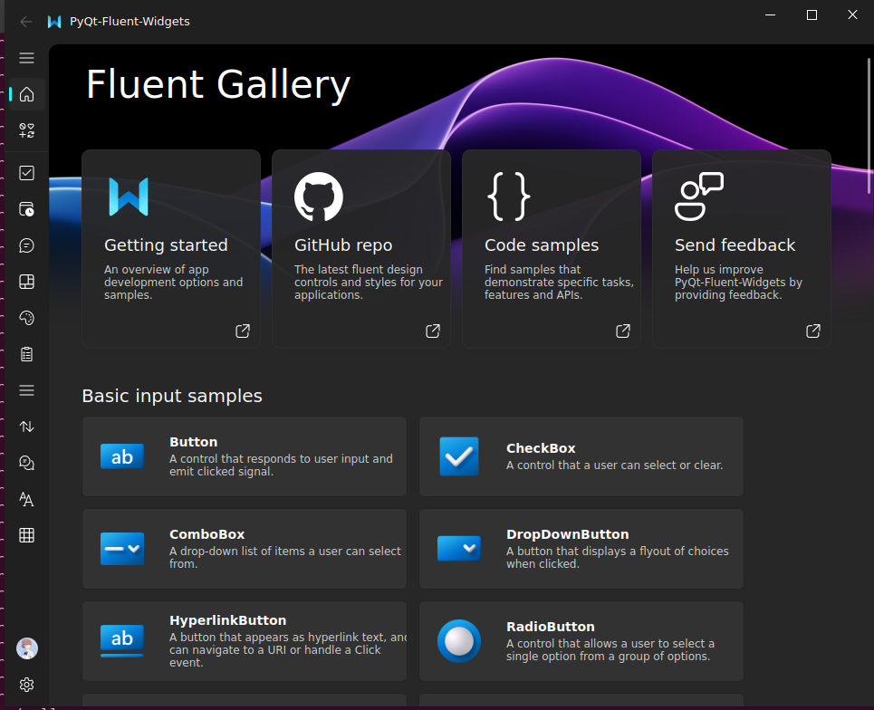

## twilwind css

- [customizing-colors](https://tailwindcss.com/docs/customizing-colors)
- [playground for tailwind](https://play.tailwindcss.com/)
- [tailwindcss](https://www.tailwindcss.cn/)
- [tailwindcss 备忘录](https://wangchujiang.com/reference/docs/tailwindcss.html)

## W3T template

- [web3templates](https://web3templates.com/)
- [astroship based astro](https://github.com/surjithctly/astroship)
- [rao.pics](https://rao.pics)
    - 软件地址： https://github.com/rao-pics/rao-pics
    - 官网源码地址： https://github.com/rao-pics/Home

- [astro](https://astro.build/blog/)

1. https://web3templates.com/preview/astroship
2. https://www.v2ex.com/t/959178#reply0

## PyQt-Fluent-Widgets

- [A fluent design widgets library based on PyQt/PySide](https://github.com/zhiyiYo/PyQt-Fluent-Widgets)

