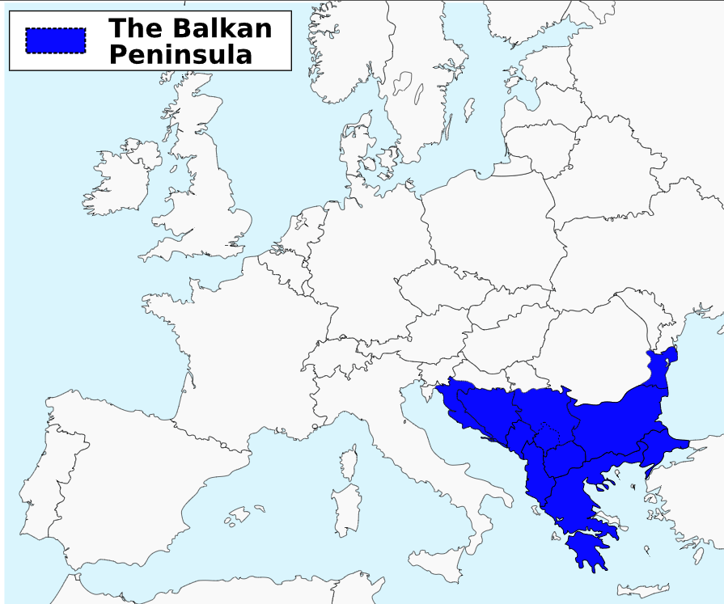
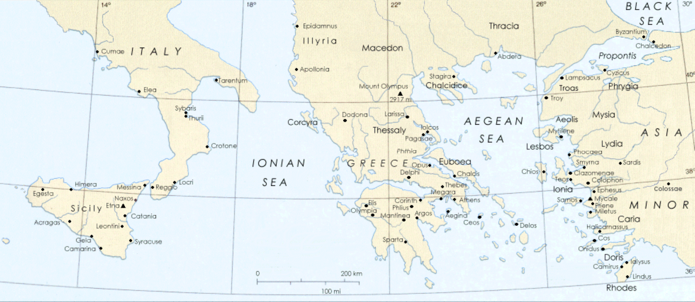
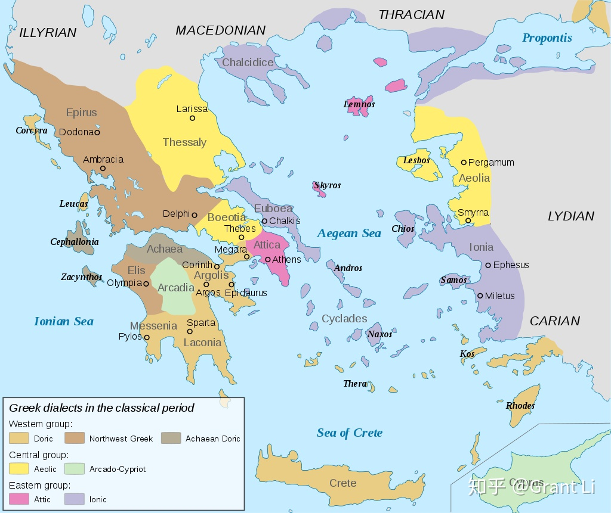

## periods overview

- Paleolithic (circa 400,000 – 13,000 BP)
- Mesolithic (circa 10,000 – 7000 BCE
- Neolithic (circa 7000 – 3000 BCE)
- Bronze Age (circa 3300 – 1150 BCE)
    - Cycladic (circa 3300 – 2000 BCE)[si'klædik]，基克拉泽斯文化
    - Minoan (circa 2600 – 1200 BCE)
    - Helladic (circa 2800 – 1600 BCE)[he'lædik], 希腊铜器时代
    - Mycenaean or Late Helladic (circa 1600 – 1100 BCE)
- Dark Ages (circa 1100 – 700 BCE) 黑暗时代
- Archaic (circa 700 – 480 BCE)[ɑːˈkeɪɪk] 中古时期/古风时期
- Classical (480 – 323 BCE) 黄金时代/古典时期
- Hellenistic (323 – 30 BCE)[ˌhelɪˈnɪstɪk] 希腊化

古代文明在同一时期并不是只有一个，而是多个并存，只是以某一个更为耀眼。在此种意义上古希腊文明变迁可简述如下：爱琴海地区孕育了早期的米诺斯文明。约BC1600年左右被迈锡尼文明开始兴盛，直至BC1400取代米诺斯文明， 文明中心从克里特岛转移至希腊大陆。BC十二世纪 多利安人(Dorian)毁灭了迈锡尼，希腊进入黑暗时代。BC五世纪 在雅典与斯巴达的领导下通过两次希波战争战胜波斯帝国，进入黄金时代。BC四世纪马其顿国王亚历山大征服希腊地区，古希腊文明开始广播各地，进入希腊化时代。

## geometry

ref:

- [Map of Ancient Greek World](https://www.plato-dialogues.org/tools/gk_wrld.htm)

**希腊周边地理**

Balkans(巴尔干半岛)： 巴尔干山脉，多瑙河水系及愛琴海水系的分水嶺. 当前位于Bulgaria(保加利亚)境内

Anatolia(安那托利亚)/Asia Minor Peninsula(小亚细亚)：

- Lydian: 吕底亚， 小亚细亚中西部古国(BC700-BC546), 印歐語系安那托利亞語族
- carian: 卡利亚

**希腊半岛大区**

Peloponnisos[,peləpə'ni:səs]: 伯罗奔尼撒
Thessaly：色萨利
Epirus: 伊庇鲁斯
Macedon: 马其顿
Illyrian: 伊利里亚，希腊半岛更北
Thracian: 色雷斯，爱琴海北端
Crete: 克里特岛

海域：

- ionian sea
- aegean sea
- sea of crete

**区域及城邦**

- 伯罗奔尼撒：Peloponnisos[,peləpə'ni:səs]
    - achaea(亚该亚/阿卡亚)
    - arcadia
    - argolis(阿尔戈利斯)

希腊中部

希腊中部，可分为10个小地区：埃尼亚尼亚（Aeniania）、阿提卡（Attica，主要城邦为雅典）、玻俄提亚（Boeotia，主要城邦为底比斯）、多利斯（Doris）、优卑亚（Euboea）、洛克里斯（Locris）、马利斯（Malis）、墨伽利斯（Megaris，主要城邦为墨伽拉）、奥塔（Oetaea）、福基斯（Phocis）

希腊西部

可分为4个小地区：阿卡纳尼亚（Acarnania）、埃托利亚（Aetolia）、阿佩兰提亚（Aperantia）、多罗皮亚（Dolopia）

- 爱琴文明：希腊及爱琴海沿岸古代文明的总称。包括Minoan, Mycenaean
- Cyprus (塞浦路斯)

**people**

**period**

## minoan period(米诺斯文明)

- 起源 BC6000
- 鼎盛：BC1600-BC1400

克里特：
克诺索斯 统治地位 王宫

日后希腊传说把克诺索斯的统治者称为米诺斯

1450-1400：线性文字B， 属希腊语，通知阶级记录财物

线形文字A -> 米诺斯线性文字
线形文字B -> 迈锡尼线性文字

之后王宫被毁，文化衰落

夕克拉底群岛：米洛斯， 赛拉岛

## Mycenaean period(迈锡尼)

米洛斯岛的黑曜石l

希腊大陆

特洛伊战争

荷马史诗和希腊神话： 阿加门农

神话人物的地域性

## socrates and plato

苏格拉底到伯拉图时期的阿提卡地图

- Anatolia(安那托利亚)/Asia Minor Peninsula(小亚细亚)

## Minoan(circa 2600 – 1200 BCE)

文明区域：克里特crete，罗得斯岛，赛普卢斯，

## Mycenaean(circa 1600 – 1100 BCE)

中心转移，希腊大陆以及爱琴海诸岛
