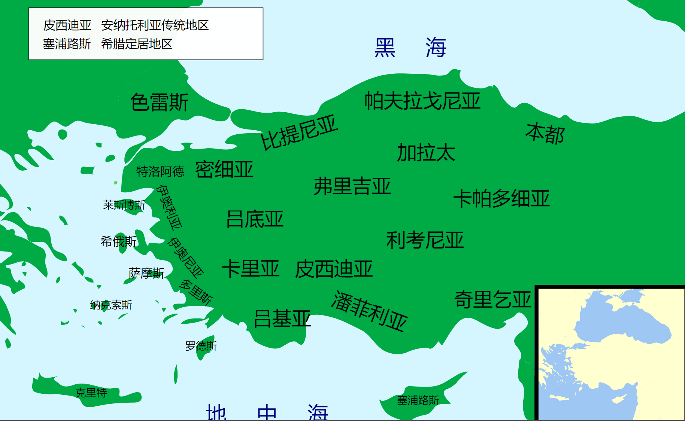

## periods overview

- Paleolithic (circa 400,000 – 13,000 BP)
- Mesolithic (circa 10,000 – 7000 BCE
- Neolithic (circa 7000 – 3000 BCE)
- Bronze Age (circa 3300 – 1150 BCE)
    - Cycladic (circa 3300 – 2000 BCE)[si'klædik]，基克拉泽斯文化
    - Minoan (circa 2600 – 1200 BCE)
    - Helladic (circa 2800 – 1600 BCE)[he'lædik], 希腊铜器时代
    - Mycenaean or Late Helladic (circa 1600 – 1100 BCE)
- Dark Ages (circa 1100 – 700 BCE) 黑暗时代
- Archaic (circa 700 – 480 BCE)[ɑːˈkeɪɪk] 中古时期/古风时期
- Classical (480 – 323 BCE) 黄金时代/古典时期
- Hellenistic (323 – 30 BCE)[ˌhelɪˈnɪstɪk] 希腊化

古代文明在同一时期并不是只有一个，而是多个并存，只是以某一个更为耀眼。在此种意义上古希腊文明变迁可简述如下：爱琴海地区孕育了早期的米诺斯文明。约BC1600年左右被迈锡尼文明开始兴盛，直至BC1400取代米诺斯文明， 文明中心从克里特岛转移至希腊大陆。BC十二世纪 多利安人(Dorian)毁灭了迈锡尼，希腊进入黑暗时代。BC五世纪 在雅典与斯巴达的领导下通过两次希波战争战胜波斯帝国，进入黄金时代。BC四世纪马其顿国王亚历山大征服希腊地区，古希腊文明开始广播各地，进入希腊化时代。

## geometry

ref:

- [Map of Ancient Greek World](https://www.plato-dialogues.org/tools/gk_wrld.htm)

**希腊周边地理**

Balkans(巴尔干半岛)： 巴尔干山脉，多瑙河水系及愛琴海水系的分水嶺. 当前位于Bulgaria(保加利亚)境内


Anatolia(安那托利亚)/Asia Minor Peninsula(小亚细亚)：

- Lydian: 吕底亚， 小亚细亚中西部古国(BC700-BC546), 印歐語系安那托利亞語族
- carian: 卡利亚


**希腊半岛大区**

Peloponnisos[,peləpə'ni:səs]: 伯罗奔尼撒
Thessaly：色萨利
Epirus: 伊庇鲁斯
Macedon: 马其顿
Illyrian: 伊利里亚，希腊半岛更北
Thracian: 色雷斯，爱琴海北端
Crete: 克里特岛


海域：

- ionian sea
- aegean sea
- sea of crete


**区域及城邦**

- 伯罗奔尼撒：Peloponnisos[,peləpə'ni:səs]
    - achaea(亚该亚/阿卡亚)
    - arcadia
    - argolis(阿尔戈利斯)

希腊中部


希腊中部，可分为10个小地区：埃尼亚尼亚（Aeniania）、阿提卡（Attica，主要城邦为雅典）、玻俄提亚（Boeotia，主要城邦为底比斯）、多利斯（Doris）、优卑亚（Euboea）、洛克里斯（Locris）、马利斯（Malis）、墨伽利斯（Megaris，主要城邦为墨伽拉）、奥塔（Oetaea）、福基斯（Phocis）
彼奥提亚
希腊西部


可分为4个小地区：阿卡纳尼亚（Acarnania）、埃托利亚（Aetolia）、阿佩兰提亚（Aperantia）、多罗皮亚（Dolopia）


- 爱琴文明：希腊及爱琴海沿岸古代文明的总称。包括Minoan, Mycenaean
- Cyprus (塞浦路斯)

- Delohi 德尔斐: 福基斯（Phocis）地区， 被古希臘人認為是世界的中心，為一處奉獻給阿波罗的泛希臘化聖地，亦為阿波羅神女祭司皮媞亞的駐地，在此傳達德尔菲神谕。在帕那索斯山上建立有阿波罗神庙。


**people**

古希腊四个主要部落：

1. dorians 多利亚/多利安人 巴尔干半岛北部， BC12世纪入侵希腊，并逐漸擴展到希臘各地， 迈锡尼文明毁灭。之后BC800年起建立斯巴達、科林斯、阿尔戈斯等城邦，社会正式向民主制度过度，古希腊黑暗时代才宣告渐渐结束
2. Achaeans 亚该亚人 亦是荷马史诗《伊利亚特》中对希腊军队的集体称谓, 常以泛指希腊人
3. Aeolians 伊奥利亚人 古希腊时期在小亚细亚滨临地中海的西至西北地区和几个近海的岛屿（尤其是莱斯沃斯岛），是众多伊奥利亚城邦的所在地。伊奥利亚北邻密细亚，本身包含其南部地区，南邻愛奧尼亞（Ἰωνία，Ionia），东邻吕底亚
4. Ionians 伊奧尼亞人 伊奧尼亞方言是古希臘世界中使用第三廣的方言，只次於多利安方言與伊歐里斯方言。建立城邦： 雅典、优卑亚岛、與基克拉泽斯。最狹義的意思，專指小亞細亞的伊奧尼亞地區。广义说是由伊奧尼亞人建立的城邦。这里指古希腊时期伊奧尼亞人的部落。



**signature**

Acropolis  [əˈkrɒpəlɪs] 卫城

**period**

## minoan period(米诺斯文明)

- 起源 BC6000
- 鼎盛：BC1600-BC1400

克里特：
克诺索斯 统治地位 王宫

日后希腊传说把克诺索斯的统治者称为米诺斯

1450-1400：线性文字B， 属希腊语，通知阶级记录财物

线形文字A -> 米诺斯线性文字
线形文字B -> 迈锡尼线性文字

之后王宫被毁，文化衰落


夕克拉底群岛：米洛斯， 赛拉岛

## Mycenaean period(迈锡尼)

米洛斯岛的黑曜石l

希腊大陆

特洛伊战争

荷马史诗和希腊神话： 阿加门农

神话人物的地域性

希腊地域概念逐渐形成

BC12-BC9

入侵 迁移

伊奥利亚人和伊奥尼亚人向东移民，至小亚细亚沿岸，在雅典帮助下打跑吕底亚，卡利亚和腓尼基人。

伊奥尼亚十二城： 米利都， 以弗所。阿提卡被当作故国，与雅典有密切地联系。《伊利亚特》混合了爱奥尼亚希腊文和其他古希腊文风

## socrates and plato

苏格拉底到伯拉图时期的阿提卡地图


## 复兴(BC850 - BC546)

#### BC850-BC730

- 宗教&文化

```yaml

贸易开放 cyprus - crete -塞拉 - 米洛斯 - 希腊大陆

BC850-BC825 腓尼基字母传入

文学： 荷马史诗 赫西奥德-《神谱》

德尔菲神谕

奥林匹亚： 宙斯神的主要圣域， 奥林匹克始于BC776

提洛：伊奧尼亞
```

- 城邦兴起(polis)

移民导致辽阔的国家难以形成，却反而造就了独立小城的景象。早期，一系列城邦开始在小亚细亚沿海出现。

克里特/多利亚城邦： 

```yaml
- 世袭国王：议事会长老。后王权衰微，10名行政官。三十长老议事会，人民大会(agora)
- 公民团： 少数人，征服者的权力，公民
- 奴隶：

保有从组成其的各村落传下来的亲缘关系，公民权世袭；主人和农奴永久化
```

斯巴达：

```yaml
- 30岁之前 集体营垒生活。 强健的体魄，勇敢，忠诚
- 之后无人反对接纳为全权公民或平等人(homoios); 未通过为次等人(hypomeion), 无选举权

国在家之上，希洛人为国有农奴，在庄园耕作，向主人交租

吕库古(Lycurgus)改革:
    - 削减国王权力
    - 议事会：在人民大会提出议案或解散大会。60岁以上平等人
    - 检查官：人民大会选举，
    - 人民大会： 所有平等人

    在军训和人民大会，所有斯巴达公民一律平等而无论家族谱系或物质财富

    第一个古典形式的城邦，各村落保持原有性质，而在政治上由统一的公民体制联合起来。

    通过军训和户籍组建，废除原始部落/胞族/氏族关系，从而避免僭主统治，形成了强大的军事实力

斯巴达对周边的征服和扩张
```

麦加拉  科林斯

- 殖民扩张

```yaml

船的改良， 舰队， 护甲

殖民点： 母邦祭台取圣火，承袭母邦宗教政治体制， 母邦派一位公民当殖民长。殖民点相对独立。需要得到神谕

米利都在BC8世纪最早建立了殖民城邦， 协助贸易

这些殖民城邦更多地承担了友好协作的关系，而不是完全的臣服

贸易的扩张：西西里岛，小亚细亚， 埃及

BC750-BC650：克里特 重要艺术中心

BC650 罗德斯取代克里特

BC7世纪-BC6世纪 科林斯 希腊最大的商业城邦

科林斯的铠甲 加尔西斯的剑
```

- 铸币

```yaml
吕底亚王盖革斯发行白金铸币  
米利都和以弗所采用, 印制带有城邦徽记。 整个希腊开始效仿
```

#### BC750-BC550 战争
    